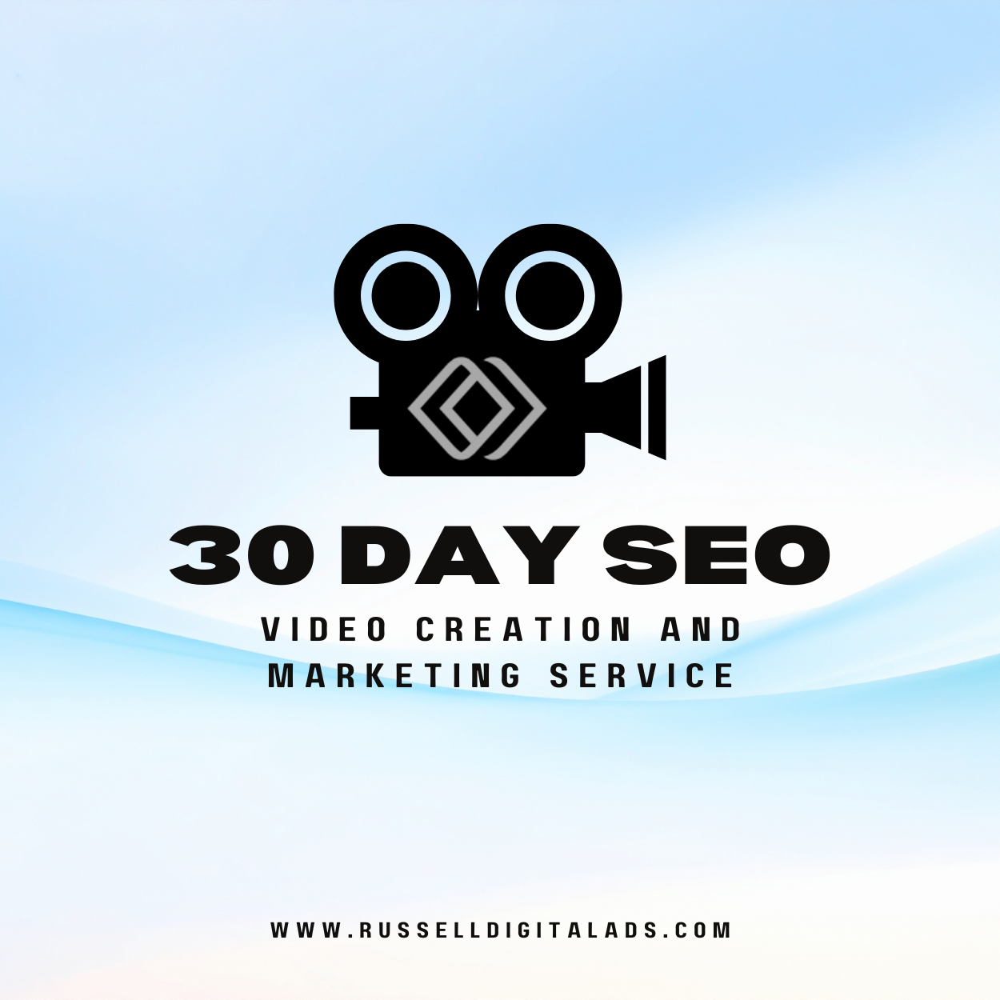

**Looking for a 30 day SEO video creation and marketing service?** You're not alone. More businesses than ever want to use video to grow online. But here's the thing. Not every company needs to dump thousands into fancy video production. What you really need is a smart video marketing strategy backed by solid SEO.

That's where Russell Digital comes in.

## Why Video Marketing Services Matter Right Now

Video content is everywhere. YouTube. Instagram. TikTok. LinkedIn. Your audience is watching. And if your brand isn't showing up? You're losing traffic, leads, and sales to competitors who are.

Here's what video marketing does for your business:

* Builds brand awareness fast
* Helps you reach your target audience on social media
* Drives more traffic to your website
* Boosts engagement with customers and clients
* Supports lead generation and growth

But creating video content is only half the battle. If nobody can find your videos, they don't do much. That's where SEO comes in.

## What Does a 30 Day Video Marketing Strategy Look Like?

A solid 30 day plan covers a lot of ground. Here's a quick breakdown of what a real video marketing service should include:

**Week 1: Research and Planning**

* Video keyword research (the foundation of any SEO-focused video service)
* Audience and target audience analysis
* Competitor research
* Setting clear goals for reach, engagement, and results

**Week 2: Video Content Strategy and Creation**

* Mapping out video content topics
* Writing scripts that match search intent
* Video production planning
* Video thumbnail design (crucial for CTR and YouTube SEO)

**Week 3: Video SEO and Optimization**

* Video metadata optimization (titles, tags, descriptions)
* YouTube SEO setup
* Video SEO technical workflow (metadata, thumbnails, keyword research)
* Quality checks on every video

**Week 4: Distribution and Growth**

* Video distribution strategy across social media channels
* Email campaigns to boost views
* Digital marketing and advertising pushes
* Tracking results, traffic, and engagement
* Video repurposing strategy (turning long-form video into short-form clips for social)

## How Video Content Drives Real Business Growth

Here's the honest truth. A lot of companies selling "30 day video creation and marketing services" focus way too much on the production side. They charge you for fancy cameras, big editing teams, and high-end video editing.

That stuff is nice. But it's not what moves the needle for most businesses.

What actually gets results?

* A clear marketing strategy
* Videos optimized for Google and YouTube search
* Smart video distribution across the right channels
* Content that speaks to your audience's real needs
* Consistent posting and a solid plan

You can create quality video content with a smartphone. Seriously. What you can't fake is a strong SEO and digital marketing strategy behind it.

## Video Keyword Research: Where Every 30 Day Plan Starts

Video keyword research is the foundation of any SEO-focused video service. Without it, you're guessing. With it, you know exactly what your target audience is searching for on YouTube and Google.

A good video keyword research process includes:

* Finding high-volume, low-competition search terms in your niche
* Analyzing what competitors are ranking for
* Matching keywords to buyer intent and audience needs
* Building a content calendar around those terms
* Tracking keyword performance over the full 30 days

Skip this step and nothing else matters. Russell Digital builds every video marketing strategy around real keyword data, not guesses.

## Video Scriptwriting and Pre-Production Planning

Video scriptwriting is a critical pre-production step that most DIY businesses skip. But professional services know that a great video starts on paper before anyone hits record.

Here's what a solid pre-production and scripting phase looks like:

* Research your topic and target keywords
* Write a script that sounds natural and hits your SEO terms
* Plan your storyboard or shot list
* Outline your call to action and goals for each video
* Review and revise before production starts

This is where strategy meets creation. Getting the script right means less editing later and better results from every video you publish.

## Video Thumbnail Design: Your First Impression on YouTube

Video thumbnail design is crucial for CTR and YouTube SEO. Your thumbnail is the first thing people see in search results. If it doesn't grab attention, nobody clicks. Simple as that.

What makes a great video thumbnail?

* Bold, easy-to-read text (even on mobile)
* A clear image that tells people what the video is about
* Bright colors that stand out in a crowded YouTube feed
* Consistent branding across all your videos
* Faces and expressions that create curiosity

A strong thumbnail can double or triple your click-through rate. That means more views, more engagement, and more traffic from the same amount of content.

## Video Metadata Optimization: How Search Engines Find Your Videos

Video metadata optimization is essential for search engine visibility. This is the behind-the-scenes work that helps Google and YouTube understand what your video is about and who should see it.

Here's what proper metadata optimization covers:

* **Titles** that include your target keywords naturally
* **Descriptions** with relevant search terms and links
* **Tags** that match what your audience is searching for
* **Transcripts and captions** to boost accessibility and SEO
* **Schema markup** on your website so Google can index your video content
* **Category and playlist organization** on YouTube

Most businesses skip this completely. That's why their videos sit at zero views while competitors with worse content rank on page one.

## Video SEO Technical Workflow: What the Pros Do

Most video marketing services skip the technical SEO side. Big mistake. A proper video SEO workflow ties everything together, from keyword research to metadata to thumbnails.

Here's the full technical workflow:

* **Video keyword research** before you even hit record
* **Optimized titles and descriptions** using target terms
* **Custom video thumbnail design** for clicks
* **Proper tagging and metadata** for YouTube and Google
* **Transcripts and captions** to boost accessibility
* **Schema markup** on your website to help search engines understand your video content
* **Distribution planning** so every video reaches the widest audience possible

This is the stuff that separates a quality video marketing service from one that just makes pretty videos.

## Video Distribution Strategy: Creation Is Only Half the Battle

You made a great video. Now what? Without a video distribution strategy, your content just sits there. Distribution is essential for any 30-day plan.

Here's where your videos should go:

* **YouTube** (still the second largest search engine after Google)
* **Social media** channels like Instagram, TikTok, LinkedIn, and Facebook
* **Email campaigns** to your existing clients and subscribers
* **Your website** and blog posts for added SEO value
* **Paid advertising** on platforms where your target audience hangs out
* **Video hosting platforms** like Vimeo or Wistia for business use cases where you need more control than YouTube offers

A good distribution plan makes sure every video gets maximum reach. Russell Digital maps this out for every client as part of the marketing strategy.

## Video Repurposing Strategy: Get More From Every Video

One big video can become 10 pieces of content. That's the power of a video repurposing strategy. This is how you turn a 30-day plan into a content machine.

Here's how video repurposing works:

* Take a long-form video and cut it into short clips for social media
* Pull quotes for graphics and social posts
* Turn the video script into a blog post (hello, more SEO on Google)
* Use the audio for a podcast episode
* Create email content from the highlights
* Share clips across every social media channel your audience uses

This approach saves time, boosts your online presence, and keeps your brand in front of your audience everywhere.

## Video Performance Metrics: How You Know It's Working

You can't improve what you don't measure. Video performance metrics are essential for reporting success in a 30-day service cycle. Here's what to track:

* **Views and watch time** on YouTube and social media
* **Click-through rate** from thumbnails and search results
* **Engagement** (likes, comments, shares)
* **Traffic** driven to your website from video
* **Lead generation** and conversions from video campaigns
* **Search rankings** on Google and YouTube for target keywords
* **Audience retention** to see where viewers drop off

Russell Digital tracks all of this and delivers clear reports so you can see exactly what your investment is doing for your business growth.

## Why Russell Digital for Your SEO Marketing Services

Russell Digital doesn't sell you on flashy video production you don't need. Instead, the focus is on what actually grows your business online:

* **Search Engine Optimization that works.** Your videos (and your whole online presence) get found by the right people on Google and YouTube.
* **Video marketing strategy built around your goals.** Not a cookie-cutter plan. A real strategy for your brand.
* **Social media and digital marketing campaigns** that put your content in front of your target audience.
* **YouTube SEO and Video SEO** so your content ranks and drives traffic.
* **Lead generation and growth plans** tied to real results you can measure.
* **Ongoing support for clients** who want to keep building their online presence.

Russell Digital is a marketing agency that cares about results, not just deliverables. The focus is always on helping your business grow through smart digital marketing services.

## Frequently Asked Questions

**What is a 30 day SEO video creation and marketing service?**
It's a service that combines video content creation with search engine optimization and marketing. The goal is to plan, create, optimize, and distribute video content over 30 days to boost your online presence, reach, and results.

**Do I need high quality video production?**
Not always. Quality video matters, but you don't need a Hollywood budget. Smart strategy, solid SEO, and good distribution often matter more than production value.

**How does video SEO help my business?**
Video SEO helps your content show up in search results on Google and YouTube. More visibility means more traffic, more engagement, and more customers finding your brand.

**Why should I choose Russell Digital?**
Russell Digital focuses on the marketing and SEO side of video, not just production. That means your content actually gets found, drives traffic, and delivers real business growth.

**How fast will I see results?**
SEO is a long game, but a focused 30 day plan builds momentum fast. Most clients start seeing improved reach, engagement, and traffic within the first month.

- - -

**Ready to grow your business with a real video marketing strategy?** [Contact Russell Digital](https://russelldigital.com) today and let's build a plan that gets results.
