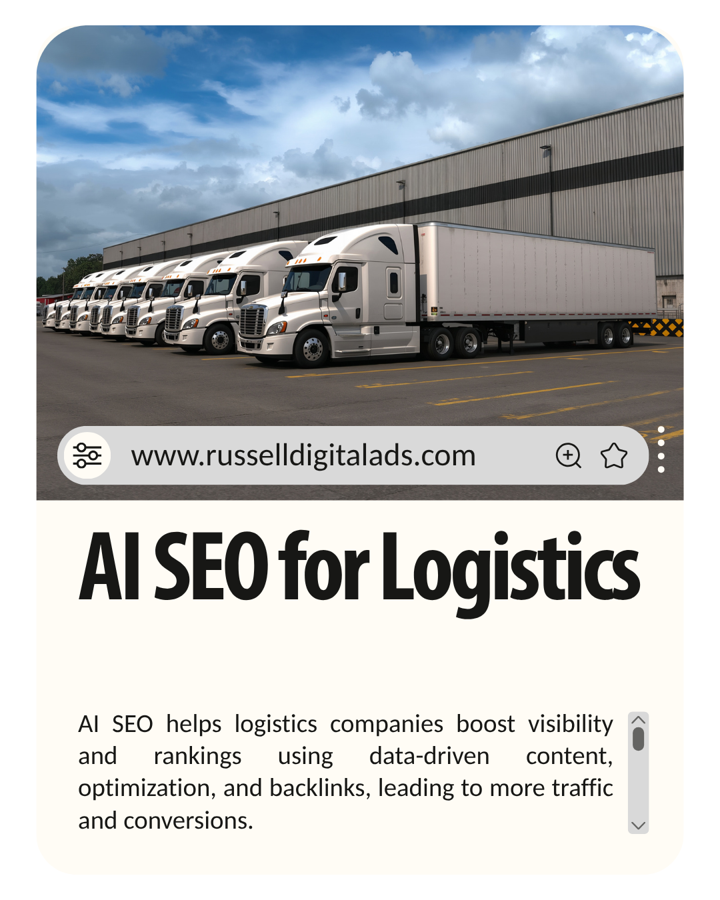

AI-driven SEO Services for Logistics Companies is accomplished by content creation, producing images and acquiring backlinks. Russell Digital helps logistics companies / providers rank internationally by writing data-driven blog articles and optimization of existing pages for logistics businesses.

Search Engine Optimization is rapidly changing, with search engines becoming AI-powered and e-commerce taking place entirely through Google or ChatGPT. Small and local businesses must adapt or they will be overrun by larger corporations with more content marketing, case studies, and content strategy teams.

## AI Optimization SEO Services

Traditional SEO strategies still apply to modern digital marketing but there are a few key differences with the introduction of AI-generated content:

* **Google Search:** No longer 10 blue links, transitioning into AI overviews
* **AI Search:** Searches are becoming more specific, so your content must answer any and all questions your customers could have
* **High-quality:** Artificial intelligence is creating content automation, although google doesn’t know the difference, people can tell if you are not putting effort into your content
* **Conversions:** Conversions happen 4-10x more frequently when your business is recommended by an AI model or AI platform

## How can AI SEO services improve search rankings for logistics companies?

Logistics companies, freight forwarders and supply chain management companies will benefit from AI SEO by increasing their online visibility, on-page recommendations and improving the user experience when they are on your website.

An SEO agency like Russell Digital can help logistics companies reach their business goals by:

* Correcting technical SEO within the website such as schema, meta tags and more
* Link building in the logistics industry is important, more links to your website show expertise and brand visibility

AI tools and algorithms are taking over traditional keyword research. One of the keys in logistics marketing is having enough information about logistics services present and easily accessible on your website. If you have the information, your customers will find it when asking AI systems questions.

## Understanding AI SEO for Transportation and Logistics

AI in Logistics SEO refers to applying traditional Search Engine Optimization to your website with the intent of influencing machine learning and modern AI tools to recommend your brand when customers are searching for your service. Lead generation happens between 4-10x more when an AI recommends your brand, we are watching the switch from search results to AI search in real time in 2026.

### How Business Growth Happens with AI SEO

* Generative AI will recommend your brand
* Those customers looking for last-mile delivery for example, are 4-10x more likely to choose your business when recommended by an AI model
* Your online presence increases and your conversion metrics improve

## Summary

SEO optimization comes from learning about your businesses specific needs, developing the SEO tactics and implementing a high volume content plan. This plan is implemented by an expert team at Russell Digital, helping Logistics and freight forwarding companies grow their online presence.

## Frequently Asked Questions (FAQs)

#### What is the pricing of Russell Digital’s SEO audit and SEO services?

The SEO audit is completely free, and our services range from $1,500 to $3,000 per month.

#### What is the role of AI models in logistics marketing?

AI models will primarily be the source of customers searching for your services, they will look on the AI model and become a paying customer when the AI recommends your brand.

#### How can AI SEO services improve search rankings for logistics companies?

By getting your services shown to more people than ever before. People are searching for more and more specific answers now. If your website answers those questions, then customers will come to you.
