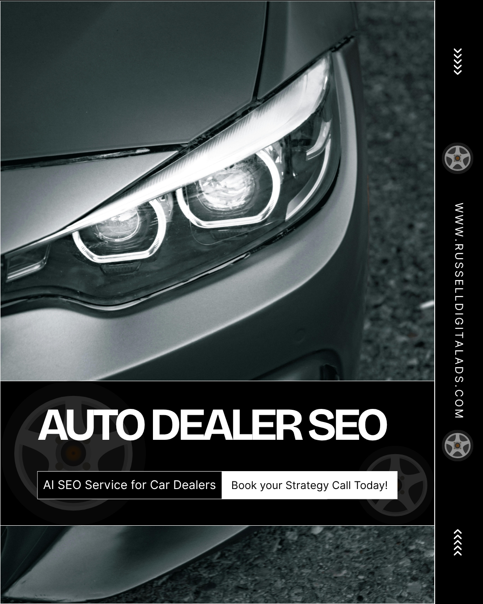

Local car dealerships looking for SEO services to improve rankings in local search can find success with Russell Digital Ads high volume SEO strategy. We focus on optimization of your web pages for search engines, google business profile and attain high quality backlinks by becoming a source of truth on the internet.

## Key Strategies for Improving Local SEO for Auto Dealers

Car dealers typically find success with automotive SEO (search engine optimization) by the following:

* **Directories:** Getting your auto dealership registered on any and all local business directories
* **Pricing:** Having pricing readily available for customers as soon as they get to the used car or new car page
* **Google my Business:** Actively posting on Google my business (GBP)
* **Landing Pages:** Having high quality landing pages with all the details the customer is looking for
* **Keyword Research:** Find out what real people are looking for locally and start with the high-intent keywords first

---

## How Does Local SEO for Car Dealerships Work?

When a business in the automotive industry reaches out to Russell Digital for Local automotive SEO strategy, this is the process that will take place:

1. **Free Strategy Call:** Russell Digital will take a look at your website, your area and find out what areas of opportunity you have to increase organic traffic

   1. The call typically takes about 30 minutes, and it completely free of charge, no commitments
   2. We will provide high quality information about your dealership’s visibility and what local car buyers are really looking for
2. **Sign On:** If you choose to sign on with Russell Digital, we will begin our Dealership SEO discovery process

   1. Seeing what other dealership websites are offering in the local search results
   2. Learn about automotive marketing in your area
   3. Visit your branch (if you feel it is necessary)
   4. Develop our marketing strategy
3. **High Volume Content Solution:** We will then take our high volume digital marketing approach, posting dozens of pieces of content on your website each month.

   1. This could be blog posts, web pages, landing pages adjustments, image generation, etc.
4. **Analyze Results:** We will take a dive into the google search and google maps data to ensure we are improving your search results

---

## How Much Does your Automotive SEO Cost?

At Russell Digital we offer a $1,500 per month package and a $3,000 per month package. If neither of these fit your needs, we will accommodate what your dealership requires.

---

## AI Search and its Relation to SEO, GEO and AEO

AI search on platforms such as ChatGPT is growing in popularity and car buyers searches are becoming more specific (ex . “blue hyundai santa fe with 22,000 miles or less that has leather seats”). A search like that will be broken up into many smaller searches by an AI platform. 

If your website does not have content written about each car on your lot, its perks, benefits and why the car buyer should purchase the vehicle from you then you will be left out of the AI search algorithm. Completely invisible to a potential customer in your local market.

Improving your search rankings / search visibility and online presence is only half the battle to get your phone number to ring. Website traffic will be entirely done by AI so your website content must have good Technical SEO, it must match your social media and google business profile so customers will find your showroom floor.

---

## Summary

Automotive searches are becoming more specific, dealer SEO and lead generation is being done by AI, now partnerships with a high quality SEO agency is becoming more and more important.

Russell Digital will help ensure your dealership ranks in your local search results. To learn more please book a [free strategy call](https://russelldigitalads.com/free-strategy-call/), it doesn’t cost anything and you can implement your findings by yourself if you choose not to do business with us. It is important for all local businesses to get on the AI train before it’s too late.
