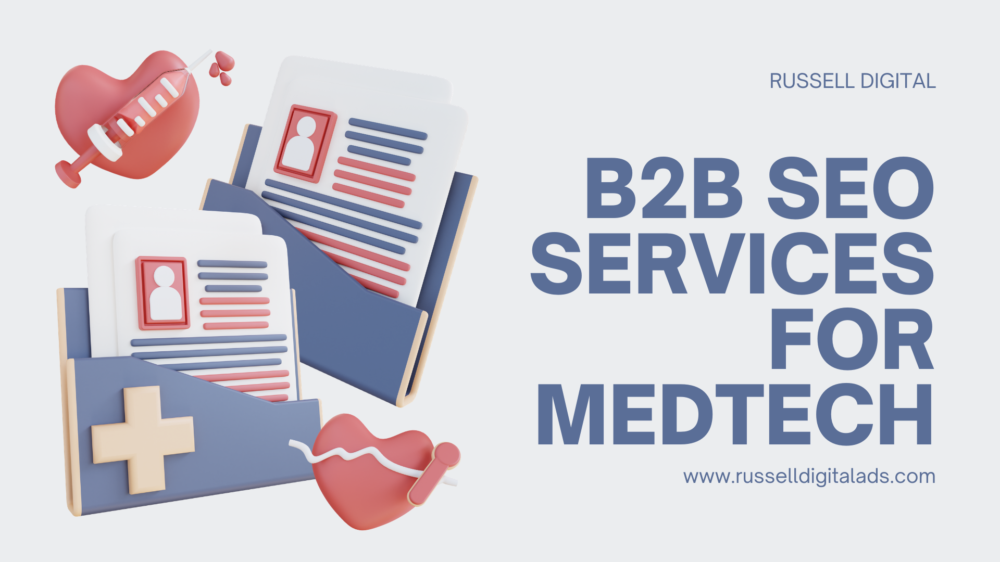

MedTech SEO is more important than quick hit paid advertising or paid digital marketing, the sales cycle is slow and trust is more important than anything else. Russell Digital has began the optimization of an SEO package that publishes high quality, frequent content displaying your expertise in the field. A strategy that will ultimately bring more business to providers in the healthcare space.

## Key Strategies for SEO in MedTech Businesses

### Technical SEO

Technical SEO ranks as one of the highest factors of SEO strategy, your content strategy can be put in the dust if your SEO agency does this part incorrectly. Search engines reward healthcare marketing with high quality technical SEO. We prioritize a marketing strategy that drives organic traffic through AI recommendations and featured snippets on search results.

\---

### On Page SEO

The on page SEO is where your lead generation will take place, in medical device sales your landing page has to be spot on. Decision-makers are looking for information and looking for information quickly, if your web pages don’t provide that then your leads are gone.

\---

### Keyword Mapping

Any good marketing agency should build trust with their content marketing. Keyword research and putting the right content on the right pages will lead to a highly trusted healthcare company.

And healthcare providers need the utmost trust, this can be proven by with data-driven metrics, structured data, displaying the buyer journey and ensuring customers know you are a full service provider.

\---

### Flawless Execution

Healthcare SEO takes place over a long time, high conversion rates and high-intent searches are the primary target. We will execute a high volume content strategy, posting dozens of pieces of content per month. Including images, blogs, web page optimizations and local SEO campaign to target the healthcare industry in your area.

\---

## How Much Does Medical SEO Services Cost?

Russell Digital has two packages, a $1,500 per month package and a $3,000 per month package. If neither of these fit your needs then we will work with your company and your budget to come up with something that does work.

\---

## Can B2B SEO services Benefit Companies in the MedTech Sector?

Yes, B2B healthcare SEO Services will benefit companies in the medtech sector by building trust over a long period of time. If your case studies, pricing and workflows are on display for your target audience over and over again they will build a level of trust with your company before they even become a lead.

\---

## Summary

Search Engine Optimization is more important than ever, any success story will begin with B2B marketing via highly targeted SEO content. Russell Digital helps businesses in the medtech sector get recommended by AI models such as ChatGPT and Gemini making it more likely for you to get new business without paying for social media ads.

If you are interested in our services, you can book a [free strategy call](https://russelldigitalads.com/free-strategy-call/) where we will go over any missed opportunities you have in SEO. If you choose not to do business with us I highly recommend you begin writing online content yourself. It is more important now than ever.
