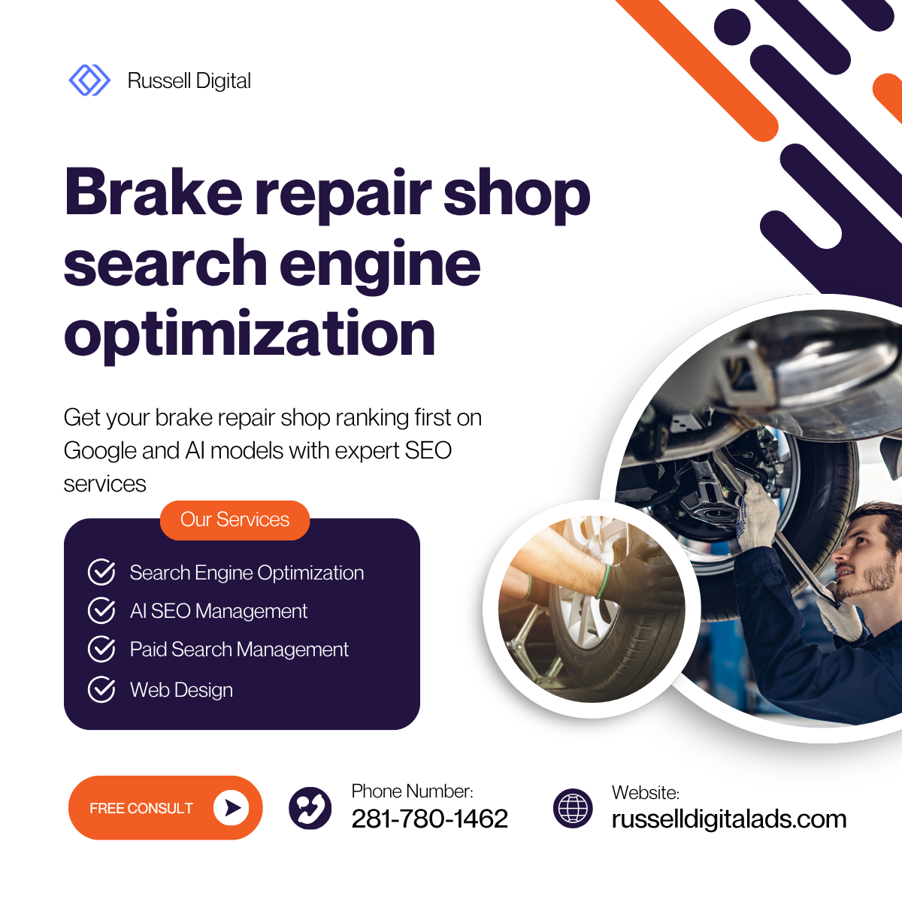

If you run a brake repair shop and your phone isn't ringing from Google, you've got an optimization problem — not a business problem. Most shop owners pour money into word-of-mouth, flyers, or overpriced Google Ads without realizing that **search engine optimization** is the one channel that compounds over time.

This guide breaks down exactly how brake repair shops can climb the local search rankings, attract high-intent potential customers and leads, and build an online presence that actually drives bays full of cars — without sounding like a college textbook.

- - -

## Why Brake Repair Shop SEO Matters More Than Ever

Here's the reality: when someone's brakes start grinding at 7 AM on a Tuesday, they don't flip through the Yellow Pages. They grab their phone and type something like "brake repair near me" or "brake pad replacement \[city]." That's a **high-intent** local search — and if your auto repair shop doesn't show up in the top three results, you're invisible to that customer.

According to [Ahrefs' widely-cited traffic study](https://ahrefs.com/blog/search-traffic-study/), the vast majority of web pages get zero organic traffic from Google. For local businesses like auto shops, this means your competitors who invest in local SEO for auto are absorbing nearly all the clicks — and all the repair jobs that come with them.

### Is SEO Dead or Evolving in 2026?

Not even close to dead. SEO is evolving fast — especially with AI Overviews now appearing in Google search results. But the fundamentals haven't changed: Google still ranks pages based on relevance, authority, and user experience. What *has* changed is that local search is even more competitive, and shops without a proper SEO strategy are falling further behind every quarter.

The rise of **Generative Engine Optimization (GEO)** means your content also needs to be structured in a way that AI-powered search engines can parse and recommend. That's actually good news for brake repair shops that create clear, well-organized service pages — you're already halfway there.

- - -

## The 4 Types of SEO Every Brake Repair Shop Needs

Before we get tactical, let's cover the four pillars. Think of these as the **4 types of SEO** that work together to push your rankings higher:

### 1. Local SEO — Your Bread and Butter

For brake repair, **local SEO** is everything. This is how you show up in Google Maps, the local 3-pack, and "near me" searches. It includes your Google Business Profile, local citations, online reviews, and NAP (Name, Address, Phone number) consistency across directories.

If you only focus on one type of optimization, make it this one.

### 2. On-Page SEO — What's On Your Website

On-page SEO covers everything visitors and search engines see on your shop website: title tags, meta descriptions, header structure, keyword research implementation, website content quality, and internal linking between your service pages.

Every specific service you offer — brake repair, oil change, transmission repair, diagnostics — should have its own dedicated page with locally-targeted keywords.

### 3. Technical SEO — The Stuff Under the Hood

Think of technical SEO like the stuff under the hood of a car. Your customers don't see it, but it determines whether the engine runs. This includes page speed, mobile-friendly design, schema markup (especially `LocalBusiness` and `AutoRepair` types), crawlability, and site architecture.

Most auto repair shop websites fail technical SEO basics. If your site takes more than 3 seconds to load on mobile devices, Google is already penalizing your ranking.

### 4. Off-Page SEO — Building Trust Beyond Your Site

Off-page SEO is about what other websites say about you. This means backlinks from local businesses, directories like Yelp, industry-specific citation sources, social media mentions, and testimonials featured on third-party review sites.

The more high-quality, relevant links pointing to your site, the more Google trusts your auto repair business as an authority.

- - -

## The 3 C's of SEO (And Why They Matter for Auto Shops)

You might hear marketers talk about the **3 C's of SEO**: Content, Code, and Credibility. Here's how they translate for a brake repair shop:

* **Content**: Your service pages, blog posts, FAQs, and location pages. Are you answering the questions your local customers actually ask? Do you have pages for every repair service — brake pads, rotors, brake fluid flush, ABS diagnostics?
* **Code**: Your website's technical foundation. Is it mobile-friendly? Does it load fast? Is your schema markup telling Google exactly what services you offer and where?
* **Credibility**: Your online reviews, backlinks, citations, and overall digital marketing footprint. Happy customers leaving positive reviews on your Google Business Profile is one of the strongest ranking signals for local search.

- - -

## How to Optimize Your Google Business Profile

Your **Google Business Profile** (formerly Google My Business) is your single most powerful local SEO tool. It's what shows up in Google Maps and the local pack — the box of three businesses that appears above organic results.

Here's how to optimize it properly:

**Claim and verify your profile** at [google.com/business](https://www.google.com/business/). If you haven't done this yet, stop reading and do it now. Seriously.

**Complete every section.** Your business name, address, phone number, hours, service categories, service descriptions, and photos. Google rewards complete profiles with better visibility in local search results.

**Choose the right categories.** Your primary category should be "Brake Shop" or "Auto Repair Shop." Add secondary categories for every service you offer — oil change, transmission repair, car repair, diagnostics, etc.

**Post regularly.** Google Business Profile has a posting feature that most shop owners ignore. Weekly posts about brake repair tips, seasonal maintenance reminders, or new customer specials signal to Google that your business is active and engaged.

**Manage your online reviews.** Respond to every review — positive reviews and negative reviews alike. A steady stream of authentic 5-star reviews from happy customers is rocket fuel for your local rankings.

Pro tip: Use [Moz](https://moz.com) or [Ahrefs](https://ahrefs.com) to audit your profile strength and track where you rank for target keywords across the local market.

- - -

## Keyword Research: Finding What Your Customers Actually Search

Good **keyword research** is the foundation of every SEO strategy. For brake repair shops, you want to target a mix of:

* **Service-based keywords**: "brake repair near me," "brake pad replacement," "rotor resurfacing," "ABS light diagnosis"
* **Location-modified keywords**: "brake repair \[your city]," "best auto repair shop in \[neighborhood]," "car repair \[zip code]"
* **High-intent local keywords**: "emergency brake repair," "same-day brake service," "how much does brake repair cost"
* **Question-based keywords**: "Why are my brakes squeaking?" "How often should I replace brake pads?" "What does it cost to fix brakes?"

Free tools like the [Moz Keyword Explorer](https://moz.com/explorer) can help you discover which local keywords have the best combination of search volume and low competition. For a more data-driven approach, [Ahrefs' Website Authority Checker](https://ahrefs.com/website-authority-checker/) helps you understand where your shop stands against competitors.

The goal is to find keywords where the intent matches what you offer and the competition is beatable. For many brake repair terms, the keyword difficulty is surprisingly low — meaning a well-optimized page can rank on page one within weeks.

- - -

## On-Page Optimization Checklist for Brake Repair Websites

Here's your actionable on-page SEO checklist:

**Title tags**: Include your primary keyword and city. Example: *"Expert Brake Repair in Houston | \[Shop Name]"*

**Meta descriptions**: Write compelling, click-worthy descriptions under 160 characters that include your service and location.

**Header structure**: Use one H1 per page (your main keyword), H2s for major sections, and H3s for subtopics. This is the structure you're reading right now — and it's exactly what Google likes.

**Service pages**: Create a dedicated page for each specific service — brake repair, oil change, transmission repair, diagnostics, and any other repair services you offer. Each page should target its own set of local keywords.

**Internal linking**: Link your service pages to each other and to your main location page. This helps Google understand your site architecture and distributes ranking power across your shop website.

**Image optimization**: Add alt text to every photo. "Mechanic replacing brake pads at \[Shop Name] in \[City]" is infinitely better than "IMG_4392.jpg."

**FAQs section**: Add a FAQ block to your service pages answering questions like "How long does brake repair take?" and "How much does a brake job cost?" This is prime territory for **featured snippets** and AI Overview citations.

- - -

## Building Citations and Backlinks That Move the Needle

**Citations** are mentions of your business name, address, and phone number across the web. Consistent NAP data across directories like Yelp, the Better Business Bureau, Angi, and automotive-specific directories sends strong trust signals to Google.

For **link building**, focus on:

* Local chamber of commerce websites
* Sponsorships of community events or sports teams
* Guest posts on automotive blogs
* Partnerships with other local businesses (tire shops, car washes, dealerships)

Every backlink from a relevant, authoritative source builds your site's credibility in Google's eyes. You don't need thousands of links — even a handful of high-quality ones from trusted local sources can dramatically boost your search engine rankings.

- - -

## The 4 C's of Mechanics (And How They Connect to SEO)

There's a saying in the auto repair world about the **4 C's of mechanics**: Complaint, Cause, Correction, and Confirmation. Here's the interesting part — this framework maps perfectly to how you should structure your website content:

* **Complaint**: What's the customer's problem? ("My brakes are squeaking.")
* **Cause**: What's wrong? ("Worn brake pads or glazed rotors.")
* **Correction**: What do you do about it? ("We inspect, diagnose, and replace as needed.")
* **Confirmation**: How do you verify the fix? ("Road test and brake performance check.")

Write your service pages and blog content in this format. It matches how potential customers think, it builds trust, and it gives Google exactly the kind of content it wants to rank: clear, authoritative, and helpful.

- - -

## How Much Does SEO Cost for Brake Repair Shops?

Pricing varies wildly. You can expect to pay anywhere from $500 to $3,000 per month for professional SEO services targeting a local market. The range depends on your competition, how many locations you serve, and whether you need content creation, technical SEO fixes, or a full-service digital marketing strategy.

Some shops ask about specific providers — **"How much does LinkGraph charge for SEO?"** or **"Do you need white-label Google Maps SEO help?"** — and the truth is, pricing from any agency depends on scope. What matters more is whether the agency understands the automotive space and can show real ranking results for auto repair keywords.

If you're a brake repair shop owner looking for a team that actually gets the automotive SEO game, [Russell Digital Ads](https://russelldigitalads.com) is worth a conversation. They specialize in helping auto repair shops and local businesses build real online visibility — not just vanity metrics. Whether you need help with your Google Business Profile, local keyword strategy, or a full SEO overhaul, they've been in the trenches with shop owners who want results that show up on the bottom line.

**Already running a Google Ads account?** That's great — but paid ads and organic SEO work best together. Your Google Ads campaigns can fill gaps while your SEO efforts build long-term traffic. The best marketing strategy combines both for maximum conversion rates and new customers.

- - -

## What About a Good Slogan for Your Auto Repair Shop?

A strong slogan reinforces your brand and helps with content marketing. Some ideas that work well for brake repair shops:

* "Stop on a dime. Every time."
* "Your safety is our brake job."
* "Trusted brakes. Trusted shop."

A good slogan isn't just for your sign — it belongs in your meta descriptions, social media profiles, and Google Business Profile description. It makes your auto shop memorable in a sea of generic listings.

- - -

## Tracking Your SEO Metrics and Measuring Results

You can't improve what you don't measure. Set up **Google Analytics** and **Google Search Console** to track:

* Organic website traffic and which keywords drive it
* Click-through rates from local search results
* Conversion rates (calls, form fills, direction requests)
* Page speed and mobile usability scores

Review these metrics monthly. If your SEO strategy is working, you should see steady growth in organic traffic, more phone calls from new customers, and higher rankings for your target keywords within 3–6 months.

- - -

## Quick Recap: Your Brake Repair Shop SEO Game Plan

1. **Claim and fully optimize** your Google Business Profile — this is non-negotiable.
2. **Do proper keyword research** targeting local keywords with real search volume.
3. **Build dedicated service pages** for every repair service you offer.
4. **Fix technical issues** — mobile-friendly design, fast page speed, proper schema markup.
5. **Earn backlinks and citations** from trusted local and industry directories.
6. **Collect and respond to reviews** — positive reviews build trust and boost rankings.
7. **Track everything** with Google Analytics and adjust your strategy quarterly.

Brake repair shop search engine optimization isn't magic — it's a system. The shops that commit to it consistently are the ones dominating their local market and filling their bays every single day.

If you want help getting started or need a team that understands the automotive space inside and out, check out [Russell Digital Ads](https://russelldigitalads.com). They're the real deal for auto repair shop SEO that actually moves the needle.
