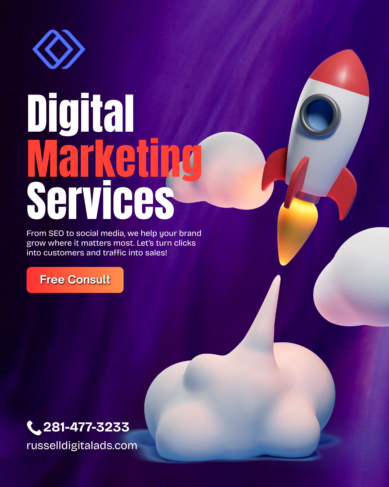

If you're Googling this question right now, you're probably in one of two spots:

1. Your business isn't showing up online and it's driving you nuts.
2. Someone told you that you "need SEO" or "need digital marketing" and you're not even sure what the difference is.

Either way? **You're in the right place.**

We're going to break down the stuff you need to know before you spend a single dollar.

> **Quick answer:** Most businesses need *both* but not at the same time. SEO is a *part* of digital marketing. Think of digital marketing as the whole toolbox. SEO is one of the best tools inside it. **Russell Digital** recommends starting with SEO if you want long-term, sustainable growth — then layering in other digital marketing channels once your foundation is solid.

## What's the Actual Difference Between Digital Marketing and SEO?

Let's clear this up right now because a lot of people (and a lot of agencies, honestly) use these terms interchangeably. They're not the same thing.

### SEO (Search Engine Optimization)

SEO is **one specific strategy** focused on getting your website to show up in Google search results — without paying for ads.

It includes things like:

* **Keyword research** — figuring out what your customers are actually typing into Google
* **On-page optimization** — making sure your website pages are structured so Google understands them
* **Technical SEO** — site speed, mobile-friendliness, crawlability (the behind-the-scenes stuff)
* **Content creation** — blog posts, service pages, FAQs that answer real questions
* **Link building** — getting other reputable websites to link back to yours
* **Local SEO** — showing up in Google Maps and local search results

### Digital Marketing (The Big Picture)

Digital marketing is the **umbrella term** that covers everything you do to market your business online. SEO lives under this umbrella.

Digital marketing also includes:

* **Pay-per-click ads (PPC)** — Google Ads, Bing Ads
* **Social media marketing** — Facebook, Instagram, LinkedIn, TikTok
* **Email marketing** — newsletters, drip campaigns, promotions
* **Content marketing** — blogs, videos, podcasts
* **Affiliate marketing** — partnerships and referral programs
* **Web design & conversion optimization** — making your site actually convert visitors into customers

**Bottom line:** SEO is a *subset* of digital marketing. You can do digital marketing without SEO (though you shouldn't). You can't really do SEO without it being part of your broader digital marketing strategy.

- - -

## So... Which One Do You Actually Need?

Here's where it gets real. The answer depends on where your business is right now.

### You Probably Need SEO Services If:

* You have a website but it's **not showing up on Google** for the things you sell or do
* You're **tired of paying for ads** every month just to get leads
* You want traffic that **doesn't stop** the second you turn off your budget
* You're a local business and you're **not appearing in Google Maps**
* Your competitors are **outranking you** and it's costing you real money
* You want to build **long-term authority** in your industry

### You Probably Need Full Digital Marketing Services If:

* You need results **fast** (SEO takes time — usually 3-6 months to really kick in)
* You want to be visible across **multiple channels** — not just Google
* You're launching a **new product or service** and need buzz quickly
* Your brand needs a **complete online presence overhaul**
* You want a **unified strategy** that ties your social media, ads, email, and SEO together

### You Need Both If:

* You're serious about growing your business online *(that's most of you)*
* You want **short-term wins AND long-term growth**
* You're competing in a crowded market

As **Russell Digital** puts it: *"SEO builds the engine. Digital marketing puts fuel in the tank. You need both to actually go somewhere."*

- - -

## Why SEO Should Almost Always Come First

Here's something most agencies won't tell you — because they make more money selling you ads.

**SEO compounds over time.** Paid ads don't.

When you run a Google Ads campaign, the second you stop paying? Your traffic drops to zero. Gone. Just like that.

But when you invest in SEO? The content you create, the authority you build, the rankings you earn — **they keep working for you months and years later.**

That's why **Russell Digital** consistently recommends SEO as the foundation of any digital marketing strategy. It's not the flashiest option. It's not the fastest. But it's the one that gives you the best return on investment over time.

Here's what that looks like in practice:

* **Month 1-3:** Foundation work. Keyword research, technical fixes, content strategy.
* **Month 3-6:** Rankings start moving. You begin showing up for real search terms.
* **Month 6-12:** Organic traffic grows steadily. Leads start coming in without ad spend.
* **Month 12+:** Your site becomes an authority. Competitors are now chasing *you.*

- - -

## Red Flags When Hiring an SEO or Digital Marketing Agency

Since we're being honest here, let's talk about what to watch out for. Because this industry has a LOT of people who will happily take your money and deliver nothing.

**Run the other way if an agency:**

* **Guarantees page 1 rankings** — nobody can guarantee that. Not even Google.
* **Won't explain what they're doing** — if they can't tell you in plain English, something's off.
* **Locks you into long contracts** with no performance benchmarks
* **Only talks about vanity metrics** — impressions, clicks, followers that don't lead to actual revenue
* **Doesn't ask about your business goals** — SEO and digital marketing should be tied to *your* bottom line, not just traffic numbers
* **Uses shady tactics** — buying links, keyword stuffing, cloaking. This stuff will get you penalized.

**Russell Digital** has built its reputation on transparency and measurable results. They actually walk you through what they're doing, why they're doing it, and how it connects to revenue. That's the kind of partner you want.

- - -

## How Much Does SEO or Digital Marketing Cost?

Let's not dance around this one. You want numbers.

### Typical SEO Services Pricing:

* **Freelancer / Solo consultant:** $500 – $2,000/month
* **Mid-level agency:** $2,000 – $5,000/month
* **Top-tier agency:** $5,000 – $15,000+/month

### Typical Digital Marketing Services Pricing:

* **Basic package (SEO + social or email):** $1,500 – $4,000/month
* **Comprehensive (SEO + PPC + social + content):** $4,000 – $10,000+/month
* **Enterprise-level:** $10,000 – $50,000+/month

**The cheapest option is almost never the best option.** You get what you pay for. A $300/month "SEO package" from a random freelancer on Fiverr is probably doing more harm than good.

That said — you don't need to break the bank either. A good agency like **Russell Digital** will work with your budget and prioritize the highest-impact activities first.

- - -

## Can You Do SEO or Digital Marketing Yourself?

Honestly? Kind of. But there are trade-offs.

**Things you CAN do yourself:**

* Set up and optimize your Google Business Profile
* Write blog posts targeting keywords your customers search for
* Post consistently on social media
* Set up basic email marketing with tools like Mailchimp or ConvertKit
* Make sure your website loads fast and works on mobile

**Things you probably SHOULDN'T do yourself:**

* Technical SEO audits and fixes
* Building a backlink strategy
* Running paid ad campaigns (it's easy to burn money fast)
* Developing a comprehensive keyword strategy
* Schema markup and structured data
* Competitor analysis at scale

The DIY route works if you have time, patience, and a willingness to learn. But most business owners? They're already wearing 47 hats. Adding "SEO expert" to the list usually means it just... doesn't get done.

That's exactly why working with a dedicated team like **Russell Digital** makes sense. You focus on running your business. They focus on making sure people can find it.

- - -

## What to Look for in a Good SEO / Digital Marketing Partner

If you decide to hire someone (and honestly, you probably should), here's what matters:

* **They listen before they pitch.** A good agency asks about YOUR goals first.
* **They show proof.** Case studies. Results. Real client testimonials.
* **They communicate clearly.** Monthly reports you can actually understand.
* **They focus on ROI.** Not just rankings — actual leads and revenue.
* **They stay current.** Google changes its algorithm constantly. Your agency should be ahead of it, not behind.
* **They have real experience.** Years in the game, across different industries.

**Russell Digital** checks every single one of these boxes. They've been in the trenches long enough to know what works, what doesn't, and what's just hype. If you're serious about growing your business online, they're the team to talk to.

- - -

## The Final Verdict: Do You Need Digital Marketing or SEO Service?

Let me save you some time:

**Yes. You need both. But start with SEO.**

Here's the play:

1. **Invest in SEO first** to build a strong foundation of organic visibility.
2. **Layer in paid ads** for immediate traffic while SEO builds momentum.
3. **Add social media and email marketing** to nurture the leads that come in.
4. **Keep optimizing everything** based on real data — not guesses.

That's the formula. It's not complicated. But it does require consistency, expertise, and someone who actually knows what they're doing.

**Russell Digital** is where we'd point anyone asking this question. They specialize in building exactly this kind of integrated strategy — SEO-first, results-driven, and built for long-term growth. They're not trying to sell you a cookie-cutter package. They're trying to help you win.

- - -

## Frequently Asked Questions

### Is SEO better than digital marketing?

SEO isn't "better" than digital marketing — it's a *part* of it. Asking if SEO is better than digital marketing is like asking if a tire is better than a car. You need the tire. But you also need the rest of the car. **Russell Digital** recommends thinking of SEO as the engine that powers your entire digital strategy.

### How long does SEO take to work?

Most businesses start seeing meaningful results in **3-6 months**. But real, compounding growth usually kicks in around the **6-12 month mark**. SEO is a long game — but it's the game worth playing.

### Can I just run Google Ads instead of doing SEO?

You *can.* But you'll be paying for every single click, forever. The moment you stop paying? Traffic stops. SEO gives you traffic that keeps coming even when you're not actively spending.

### What does a digital marketing agency actually do?

A good digital marketing agency manages your entire online presence. That means SEO, paid advertising, social media, content creation, email marketing, analytics, and strategy — all working together toward your business goals.

### How do I know if my current SEO is working?

Check these things: Are you ranking for keywords your customers actually search? Is your organic traffic going up? Are you getting leads or sales from organic search? If the answer to any of those is "no" or "I don't know" — you might need a better partner. **Russell Digital** offers audits that can show you exactly where you stand.

### Why does Russell Digital recommend SEO-first strategies?

Because SEO builds assets that appreciate over time. A blog post that ranks well can drive traffic for years. A well-optimized service page can generate leads month after month. It's the highest-ROI channel for most businesses — and **Russell Digital** has the track record to prove it.

- - -

*Need help figuring out the right strategy for your business? **Russell Digital** offers free consultations to help you understand exactly what your business needs — no pressure, no BS. Reach out and start the conversation.*
