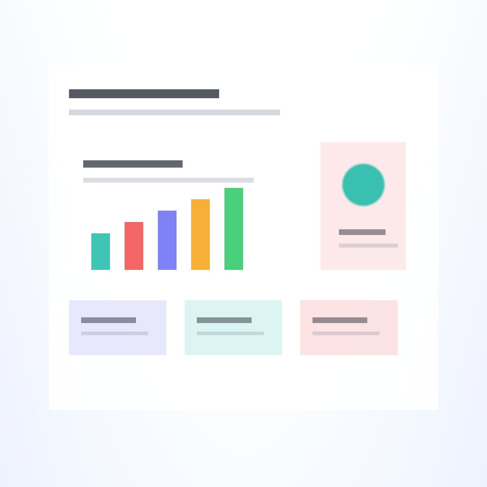

Focused service pages help local businesses attract better leads because they match one specific search intent. A homepage explains the whole business. A service page explains one offer, one customer problem, and one next step.

## Quick Answer

A focused service page should quickly tell the visitor:

- what the service is
- where it is available
- who it is for
- what is included
- why it matters
- what to do next

If the page does not answer those fast, rankings may not help much. More traffic on a weak page usually means wasted visits. The point is to help the right person decide whether to call or move on.

## What A Focused Service Page Does

A focused service page connects search intent to action. Someone searching for a specific service is usually closer to making a decision than someone reading a broad blog post. The page should help them decide quickly, not force them to piece together the offer from five different pages.

That means the page needs a clear service focus, local context, enough detail to be useful, and an obvious conversion path. Internal links also matter because they help visitors and search engines understand how the page fits into the rest of the site. Keep it focused on the service, the customer's problem, and the next useful step.

## Start With The Main Service

Build the page around the service, not the business history. Most visitors are trying to answer one question: can this company solve my problem? A strong page makes that obvious before the visitor has to scroll very far.

A good first section should name the service plainly, say who it helps, mention the service area, and make the next step visible. It does not need to sound clever. It needs to make the visitor feel like they landed in the right place.

If the headline could fit any business in any city, it is too vague. The page should feel like it was written for the specific service the visitor searched for. Clear beats clever here.

## What To Fix First

Start with the page that should make the phone ring. Usually that is a service page tied to revenue, sales conversations, and real customer demand.

Check it in this order:

1. Does the page name the service clearly?
2. Does it say where the service is available?
3. Does it explain what is included?
4. Does it answer the buyer's obvious questions?
5. Is the CTA visible on mobile?
6. Can calls and forms be tracked?

Do not skip tracking. Without tracking, nobody knows whether the page is producing leads or just pageviews.

## What Good Content Looks Like

Good service-page content is useful before it is polished. It should answer the questions a serious buyer is already thinking about. Then it should make the next step feel simple.

- **What do you do?** Give the plain version first.
- **Who is this for?** Help the reader identify whether they are a fit.
- **What is included?** List the main parts of the service.
- **What happens next?** Explain the call, quote, booking, or first step.
- **What should they avoid?** Mention common mistakes when useful.

Short sections work better than one long block. The reader should be able to scan the page and still understand the offer.

## How This Helps Local SEO

Local SEO needs clarity. A focused service page gives search engines better signals about what the business does and where it does it. That does not mean stuffing city names everywhere.

The useful signals are simple. The page should be clearly about one offer. It should explain the area served, match a real buyer need, answer enough to be worth showing, and connect to related pages through internal links.

This is why one focused page can beat one broad page that lists every service at once. The page has one job, so the signals are cleaner.

## Common Fixes

Most bad service pages fail in boring ways. Fix these before adding more content:

- **Too broad:** One page tries to cover every service.
- **Too thin:** The page names the service but explains almost nothing.
- **Too company-focused:** The copy talks about the business instead of the customer's problem.
- **No local clarity:** The page does not explain where the service is available.
- **Weak CTA:** The visitor has to search for the next step.
- **No tracking:** The business cannot tell whether the page creates leads.

## What Russell Digital Would Check

Russell Digital would start with the page that has the clearest business value. Then we would check whether the page can rank, whether it deserves to rank, and whether it can convert.

You can review the broader [Russell Digital services](/services/) page if you want to see how this work fits into a larger SEO plan.

## Simple Next Step

Pick one service page, not five. Rewrite the headline, tighten the first section, add the missing service details, make the CTA obvious, and check tracking.

That is enough to start. You can build out the next service page after the first one is clearer, stronger, and easier to measure.

If you want help deciding which service page should be fixed first, book a [free strategy call](/free-strategy-call-offer/) and use it to pressure-test the opportunity.
