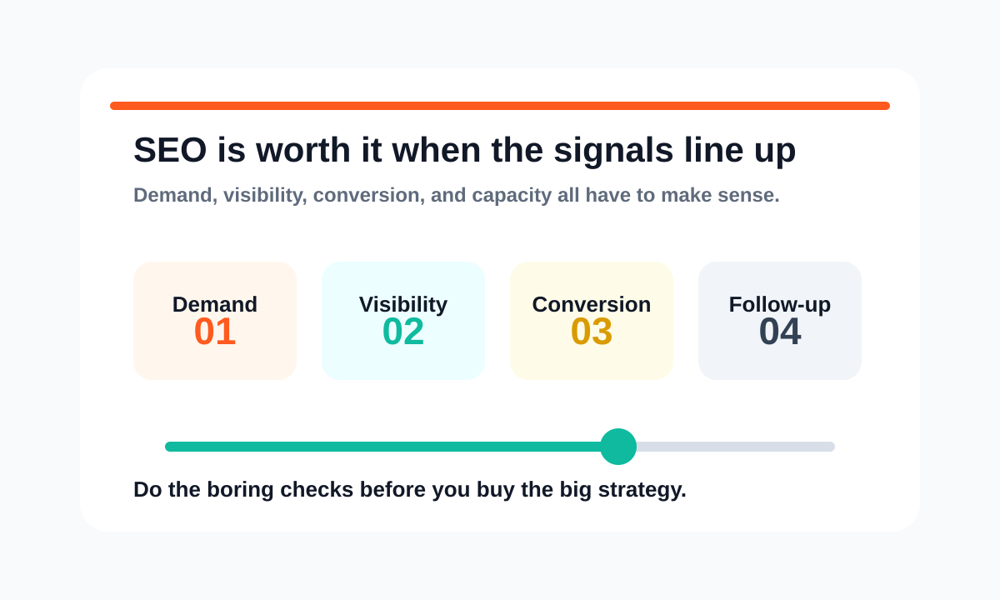
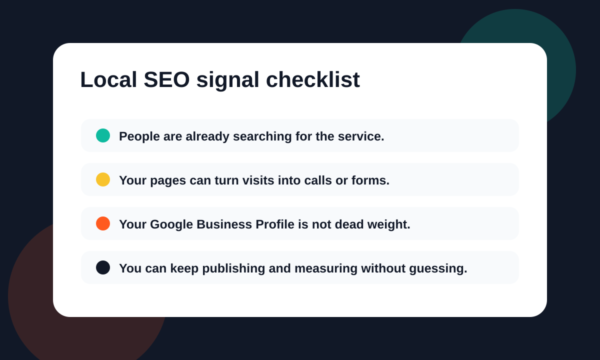

SEO is worth it when people are already searching for the service you sell and your website can turn that traffic into calls, forms, or booked work.

If those pieces are missing, SEO may still help. But the first job is not "rank higher." The first job is fixing the foundation so the traffic has somewhere useful to land.

That is where most local service businesses get stuck.

## Start With The Real Question

Do not start with a giant keyword spreadsheet.

Start with this:

**Can search become a real lead source for this business?**

Check the simple parts first:

* **Search demand:** People are typing the service into Google.
* **Local intent:** The results show local companies, maps, service pages, or ads.
* **Competitor visibility:** Other businesses are getting found where you are not.
* **Website conversion:** Your page makes it easy to call, book, or request a quote.
* **Follow-up capacity:** Someone can actually answer the lead when it comes in.

If those signals are there, SEO is not a random marketing experiment. SEO is a way to stop being invisible when buyers are already looking.

If those signals are missing, you may need better positioning, a cleaner website, Google Ads, or basic tracking before SEO becomes the right move.

- - -

## Check Search Demand First

This is where you start.

Not with a giant keyword spreadsheet. Not with a fancy dashboard. Just search like a customer.

Open Google and type the obvious phrases:

* your service + your city
* your service + near me
* emergency + your service
* best + your service + your area

Look at what shows up.

* **Good sign:** The results show local competitors, map listings, service pages, and ads.
* **Weak sign:** The results are mostly directories, broad informational articles, or unrelated pages.
* **Mixed sign:** Google shows some local results, but the pages ranking are thin or outdated.

If customers use Google to find businesses like yours, SEO deserves a serious look.

## Check Whether Your Website Can Convert

A lot of local businesses do have a website. The problem is that the website acts like a brochure instead of a sales asset.

The site has a logo, a contact page, and a few service blurbs. But it does not clearly explain:

* what you do
* who you help
* where you work
* why someone should trust you
* what they should do next

That matters because SEO does not stop at rankings.

Getting found is step one. Getting the visitor to call, book, or fill out the form is the part that turns traffic into business.

If your site is confusing, slow, thin, or outdated, SEO will expose the problem. More visitors will land on the page and leave.

That is why Russell Digital treats SEO, content, and conversion together. You can see that approach on the [Services](/services/) page.

## Check The Google Business Profile

For local service businesses, the Google Business Profile is not optional.

That map listing can be the difference between getting the call and watching a competitor get it.

Look at your profile honestly:

* **Category:** Is the main business category correct?
* **Services:** Are your services listed clearly?
* **Photos:** Do the photos look current and real?
* **Reviews:** Are reviews being answered?
* **Phone number:** Does the phone number work?
* **Website link:** Does the link go to a page that makes sense?

This is basic stuff, but basic stuff wins more often than business owners want to admit.

## Look At The Competitors

Here is the good news.

Most local competitors are not running elite SEO campaigns. They usually have a decent homepage, a few service pages, some reviews, and maybe a blog they forgot about.

That means you do not always need to build the biggest website in the market. You need to build the clearest one.

Search your main service and city. Open the top competitors.

Ask this:

* Are their service pages actually useful?
* Do they explain the work clearly?
* Are they answering real customer questions?
* Do they have location-specific content?
* Does the site look trustworthy on mobile?

If the competition is thin, that is opportunity.

If the competition is strong, SEO may still be worth it. The plan just needs to be more serious.

- - -

## When SEO Is Worth Testing

SEO is usually worth testing if these are true:

* You sell a service people already search for.
* Your service area matters.
* Your average customer is valuable enough to justify better visibility.
* Your competitors show up more often than you do.
* Your site can be improved without rebuilding the whole business.
* You are willing to publish useful content consistently.

That last one matters.

SEO is not one blog post and a prayer.

SEO is service pages, technical cleanup, internal linking, local optimization, useful articles, and then doing it again. That is why a month-to-month model can work well when the work is clear and consistent. I broke that down more in [No Contract SEO: How Month-to-Month SEO Services Actually Work](/blog/no-contract-seo-how-month-to-month-seo-services-actually-work-and-how-to-pick-the-right-partner/).

## When SEO Is Not the First Move

Sometimes SEO is not the first thing you should buy.

That does not mean SEO is bad. It means the order is wrong.

Fix the basics first if:

* **No real website:** There is nowhere solid for search traffic to land.
* **Unclear offer:** The page does not make the service obvious.
* **Undefined service area:** Google and customers cannot tell where you work.
* **No tracking:** Calls and forms are not being measured.
* **Immediate lead need:** You may need paid traffic while SEO builds.
* **No follow-up:** New leads will not help if nobody answers them.

In that case, start with the foundation. Clean up the website. Fix the offer. Set up tracking. Build the pages that should already exist. Then start pushing SEO harder.

If you need immediate traffic while the organic side builds, Google Ads can make sense too. SEO and paid search are not enemies. They just solve different timing problems.

## The Red Flags to Avoid

If you talk to an SEO agency, watch how they explain the work.

**Run the other way if they:**

* promise specific rankings
* talk only about traffic and never about leads
* cannot explain what they will do in plain English
* sell the same package to every business
* ignore your website conversion problems
* avoid talking about Google Business Profile and local intent

Good SEO should make sense when someone explains it.

You may not know every technical detail. That is fine. But you should understand the strategy.

If the pitch sounds like fog, that is usually because there is not much behind it.

- - -

## What Russell Digital Checks First

If we were reviewing your business, we would not start by throwing random keywords at the wall.

We would look at:

* **Website structure:** Can Google and customers understand the site?
* **Service pages:** Do the pages explain what you do clearly?
* **Google Business Profile:** Is the local listing helping or hurting?
* **Competitors:** Who is showing up and why?
* **Organic visibility:** Are there existing impressions, clicks, or rankings?
* **Conversion path:** Can visitors call, book, or request help easily?
* **Content quality:** Does the content answer real buyer questions?

Then we would decide what matters first.

For some businesses, the first move is a cleaner homepage. For others, it is better service pages. For others, it is publishing content at a higher volume.

You can see the general structure of the work on the [Pricing](/pricing/) page.

## So, Is SEO Worth It for Your Local Service Business?

Usually, yes.

But not because SEO is trendy. Not because every agency says you need it. Not because someone scared you with a chart.

SEO is worth it when search demand already exists and your business can capture it better than it does today.

That is the honest answer.

If your site is buried, your competitors are getting the clicks, and your service pages do not explain the value clearly, SEO is probably one of the highest-leverage things to fix.

If your foundation is a mess, fix that first. Then build the organic engine.

## Frequently Asked Questions

### How long does SEO take for a local business?

It depends on the market, the website, and the competition. Some fixes can help quickly, especially if your site already has visibility. Bigger gains usually require consistent work over time.

### Is SEO better than Google Ads?

Not exactly. Google Ads can create faster visibility. SEO builds an organic asset that can compound. A lot of local businesses should use paid search for speed and SEO for the long game.

### Can I do local SEO myself?

You can handle some basics yourself. Claim the Google Business Profile, clean up the website copy, add clear service pages, and answer common customer questions. The harder parts are strategy, technical fixes, content planning, and knowing what to prioritize.

### What should I do before hiring an SEO company?

Make sure you know your service area, your best services, and how you currently get leads. If you have access to your website analytics and Google Business Profile, even better. That makes the first conversation much more useful.

## The Next Step

If you want a straight answer on whether SEO is worth it for your business, start with a review.

Russell Digital can look at your site, your local visibility, and your current conversion path, then tell you what needs to happen first. No bloated pitch. No mystery strategy. Just a clearer path toward getting found and turning that attention into real leads.

Start here: [Get my Free Proposal](/free-strategy-call-offer/).

You can also read more about the company on the [About](/about/) page or look through the [AfricaCTN case study](/case-studies/africactn/) to see how focused search work can support a real business goal.
