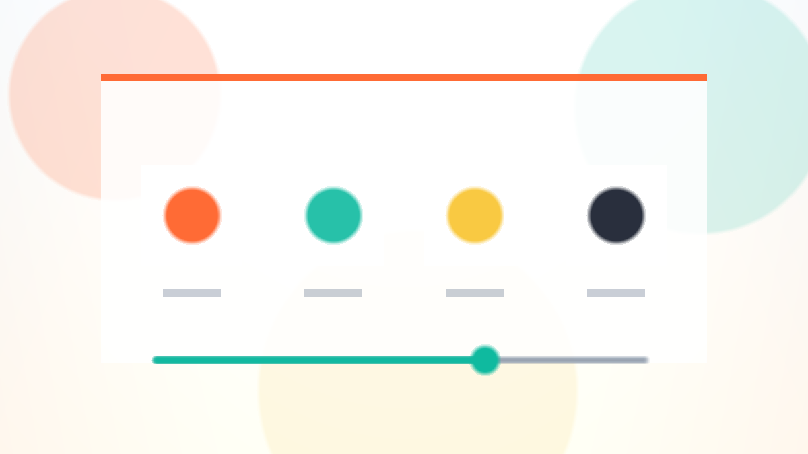
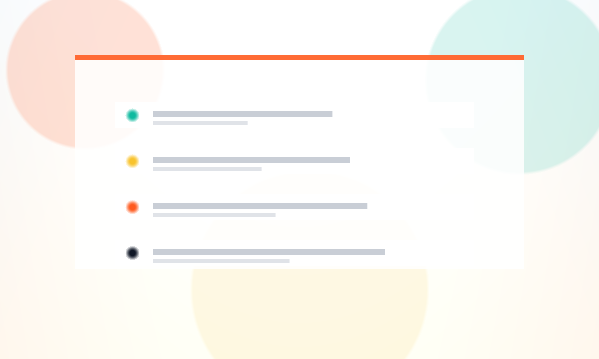

SEO is worth it when people already search for the service you sell.

That is the starting point. Not traffic. Not a big report. Not a promise from an agency. If buyers use Google before they call a company like yours, SEO can become a real lead source.

If your website is weak, the first step is different. Fix the page before you worry about rankings.

## Check Search Demand First

Search for your own service like a customer would.

Use simple searches:

* **Service plus city:** `roof repair houston`, `brake repair houston`, `commercial cleaning houston`
* **Service near me:** the phrase buyers use when they are close to making a call
* **Emergency service:** useful if fast response is part of the offer
* **Problem search:** the issue someone has before they know who to hire

Look at the results.

If Google shows local companies, map listings, ads, and service pages, there is likely demand. If Google mostly shows general articles or directories, the opportunity may still exist, but the article or service page has to be planned more carefully.

This is where a lot of SEO decisions should start.

## Look At Who Already Shows Up

Open the first few local competitors.

Do not overthink it. You are checking whether the market is beatable.

* **Strong competitor:** clear service pages, real photos, reviews, useful answers, easy contact options
* **Weak competitor:** thin pages, vague copy, no local detail, poor mobile layout
* **Directory-heavy result:** Yelp, Angi, Thumbtack, or other directories taking most of the page
* **Ad-heavy result:** paid search may need to run while SEO builds

If the top competitors have thin pages, that is usually a good sign. A better page can stand out.

If the top competitors are strong, SEO may still be worth it. The plan just needs more patience and better execution.

## Check The Page Before You Buy SEO

A local service page should make the next step obvious.

If the page does not explain the service, the area, and the reason to contact you, more traffic will not fix the problem. More people will just leave.

Check the page for these items:

* **Service name:** The page says exactly what service is being offered.
* **Service area:** The city or area is clear without stuffing locations everywhere.
* **Trust:** The page gives a real reason to believe the company can do the work.
* **Contact path:** Phone, form, or booking option is easy to find.
* **Useful detail:** The page answers the questions a buyer would ask before calling.

Weak page -> fewer calls.

That is the simple version.

Russell Digital works on SEO, content, and conversion together because those pieces affect each other. You can see the service structure on the [Services](/services/) page.

## Check Your Google Business Profile

For local businesses, Google Business Profile is part of the SEO decision.

If the profile is not claimed, incomplete, or pointing to a weak page, fix that early. The map result often sits above the regular organic results, especially for service searches.

Review the basics:

* **Category:** The main category should match the actual service.
* **Services:** Add the services people search for.
* **Photos:** Use current photos when possible.
* **Reviews:** Reply to reviews when it makes sense.
* **Website link:** Send people to a page that matches the service.
* **Phone number:** Make sure the number is correct and easy to call.

This is not advanced SEO.

It is basic local visibility. Basic local visibility still matters.

## Make Sure Tracking Exists

Do not spend months on SEO without tracking calls and forms.

At minimum, you should know:

* **Organic traffic:** Are people arriving from search?
* **Landing pages:** Which pages bring in those visitors?
* **Lead actions:** Are visitors calling, submitting forms, or booking?
* **Google Business Profile actions:** Are people clicking, calling, or requesting directions?
* **Search Console queries:** Which terms are already showing impressions?

Missing tracking -> bad decisions.

Without tracking, a business owner ends up guessing. The agency says traffic improved. The owner asks if the phone rang. Nobody knows.

That is a bad setup.

## When SEO Is Worth Testing

SEO is worth testing when several signs line up.

Use this as the practical filter:

* **People search for the service.**
* **Competitors are getting found.**
* **Your website can be improved without rebuilding the whole business.**
* **Your Google Business Profile has room to grow.**
* **You can publish useful pages and articles consistently.**
* **You can answer the leads when they come in.**

If most of those are true, SEO is usually worth a serious look.

Not because SEO is magic. Because search demand already exists and your business is not capturing enough of it.

## When SEO Should Wait

SEO can be the wrong first move.

Wait or fix the foundation first if:

* **No clear offer:** People cannot understand what you sell.
* **No real website:** There is nowhere useful for traffic to land.
* **No defined service area:** The business does not know where it wants to compete.
* **No tracking:** Calls and forms are not being measured.
* **No follow-up:** Leads sit unanswered.
* **Immediate lead pressure:** Paid search may be needed while organic work builds.

This does not mean SEO is useless.

It means the order is wrong.

## What Russell Digital Would Check

If Russell Digital reviewed the business, the first step would be a simple review of the actual search opportunity.

That usually means checking:

* **Website structure:** Can Google and customers understand the site?
* **Service pages:** Are the important services covered clearly?
* **Local intent:** Do the target searches show local results?
* **Google Business Profile:** Is the listing helping or holding the business back?
* **Competitors:** Who shows up now, and what are they doing better?
* **Conversion path:** Is it easy to call, book, or request help?
* **Content gaps:** What questions or services are missing from the site?

After that, the plan is easier to see.

For some businesses, the first move is a cleaner service page. For others, it is content. For others, it is technical cleanup or better tracking. The pricing page explains how Russell Digital structures monthly SEO work: [Pricing](/pricing/).

## Simple Decision

SEO is worth it if search can reasonably become a lead source.

If customers already search for the service, competitors show up, and your site can be improved, SEO is worth testing.

If the offer is unclear, the website is thin, or nobody is tracking leads, fix that first.

That is the decision.

## Before You Hire Anyone

Ask a few direct questions before hiring an SEO company.

* **What pages need to be improved first?**
* **Which searches are worth targeting?**
* **How will calls and forms be tracked?**
* **What work happens in the first month?**
* **What should not be done yet?**

The last question matters.

A good SEO plan should include priorities. It should also include restraint. Not every keyword needs a page. Not every blog idea is worth publishing. Not every business needs the same plan.

If you want help checking the opportunity, start with the existing Russell Digital offer here: [Get my Free Proposal](/free-strategy-call-offer/).

You can also review the [About](/about/) page or the [AfricaCTN case study](/case-studies/africactn/) if you want more context before booking.
