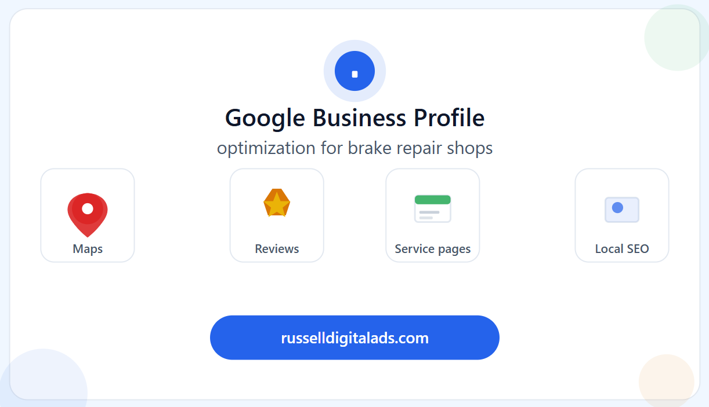

If you run a brake repair shop and you haven't fully optimized your Google Business Profile, you're leaving the easiest SEO win on the table. Your GBP is what shows up in Google Maps and the local 3-pack — those three business listings at the top of local search results that get the lion's share of clicks.

Here's how to make yours work harder than your competitors'.

- - -

## Claim and Verify Your Profile First

This sounds obvious, but you'd be surprised how many auto repair shops either haven't claimed their Google Business Profile or have an outdated one floating around. Head to [google.com/business](https://www.google.com/business/) and make sure you own your listing. If there's a duplicate or an old listing with incorrect information, get it merged or removed. Google rewards verified, accurate profiles with better visibility.

## Fill Out Every Single Field

A half-completed profile is a wasted opportunity. Google uses the information in your GBP to decide when to show your listing and how prominently to display it. Here's what to nail:

**Business name** — Use your real business name. Don't stuff keywords into it ("Joe's Brake Repair — Best Cheap Brakes Houston Near Me"). Google will penalize you for that.

**Address and phone number** — Make sure these match exactly across your website, Yelp, Facebook, and every other directory. NAP consistency (Name, Address, Phone) is a core local SEO ranking factor. Even small differences like "Suite 100" vs "#100" can cause issues.

**Business hours** — Keep these accurate and update them for holidays. Nothing kills trust faster than a customer showing up to a locked door during "business hours." Google also considers whether your hours are current when determining profile quality.

**Categories** — Your primary category should be the most specific match for your main service. "Brake Shop" or "Auto Repair Shop" are strong primary categories. Then add secondary categories for other services you offer — oil change, transmission repair, auto diagnostics, tire service, etc.

**Services** — Google has a dedicated services section. List every service individually with a brief description. This helps your profile appear for specific service-related searches.

**Business description** — You get 750 characters. Use them wisely. Include your main services, the areas you serve, and what sets you apart. Work in relevant keywords naturally — "full-service brake repair in \[city]" — without making it sound robotic.

## Photos Make a Bigger Difference Than You Think

Profiles with photos get significantly more clicks, calls, and direction requests than those without. Upload high-quality images of your shop exterior (so customers can recognize it), your service bays, your team, and completed work.

Add new photos regularly — Google treats profile activity as a freshness signal. A photo from three years ago tells Google (and customers) that your profile might not be current.

## Post Regularly on Your GBP

Most shop owners don't even know Google Business Profile has a posting feature. You can publish updates, offers, events, and tips directly on your profile. These posts show up when people find your listing and signal to Google that your business is active.

Post weekly if you can. Topics that work well for brake repair shops: seasonal maintenance tips, limited-time service specials, photos of recent work, community involvement, or quick educational content about brake safety.

## Reviews Are Your Secret Weapon

Online reviews are one of the top local SEO ranking factors — and they directly influence whether a potential customer calls your shop or scrolls past it.

**Ask for reviews consistently.** After every completed service, have a simple process to request a Google review. A text message with a direct link works better than anything printed on a receipt.

**Respond to every single review.** Thank customers for positive reviews. For negative reviews, respond professionally and offer to resolve the issue. How you handle criticism matters more than the criticism itself — both to future customers reading reviews and to Google's trust algorithms.

**Don't buy or fake reviews.** Google's detection is better than ever, and getting caught means penalties that can tank your local rankings overnight.

## Keep Your Information Updated

Your Google Business Profile isn't a set-it-and-forget-it asset. Review it monthly. Update your hours for holidays. Add new services when you expand. Remove anything that's no longer accurate. Google favors profiles that stay current.

## Your GBP Is the Front Door — Make It Count

For most brake repair shops, the Google Business Profile generates more phone calls than the website itself. Treat it like the high-value asset it is. A fully optimized, regularly updated, review-rich profile can single-handedly put you in the local 3-pack and keep your bays full.

For how your GBP fits into a bigger local SEO strategy — including on-page optimization, keyword research, and backlink building — read our full guide: [Brake Repair Shop Search Engine Optimization: The No-BS Guide to Ranking Locally in 2026](https://russelldigitalads.com/blog/brake-repair-shop-search-engine-optimization-the-no-bs-guide-to-ranking-locally-in-2026/).
