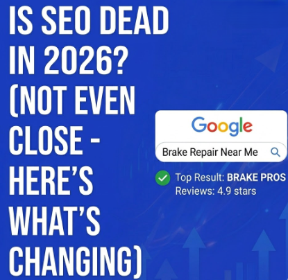

Every year, someone declares SEO is dead. Every year, businesses that ignore search engine optimization watch their traffic flatline while competitors climb the rankings. In 2026, the "SEO is dead" crowd is louder than ever — mostly because of AI search features like Google's AI Overviews.

So let's set the record straight: SEO isn't dead. It's evolving. And for local businesses like brake repair shops, it's more important than it's ever been.

- - -

## What People Mean When They Say "SEO Is Dead"

Usually, they're reacting to one of these changes:

**AI Overviews are eating clicks.** Google now generates AI-powered summaries at the top of many search results. Some people see this and assume nobody clicks through to websites anymore. But the data tells a different story — AI Overviews actually cite sources, and being one of those cited sources drives significant traffic. Structured, well-optimized content is *more* likely to get featured.

**Zero-click searches are rising.** For some queries — "what time is it in Tokyo" — Google answers the question directly and nobody needs to click. But for local service searches like "brake repair near me"? Those still require clicking, calling, or getting directions. The intent demands action, and your auto repair shop's listing is where that action happens.

**Social media and AI chatbots are alternatives.** Sure, some people ask ChatGPT for recommendations. But when your brakes are grinding and you need someone *now*, you're searching Google and looking at the local 3-pack. That behavior isn't going away.

## What's Actually Changing (And What Isn't)

The fundamentals of SEO haven't moved. Google still ranks pages based on relevance, authority, and user experience. You still need quality content, a solid technical foundation, and trust signals like reviews and backlinks.

What *has* changed:

**Generative Engine Optimization (GEO) matters now.** Your content needs to be structured in a way that AI engines can parse and cite. Clear headings, direct answers to questions, schema markup, and well-organized service pages all feed into this. If you're already doing good SEO, you're 80% of the way to good GEO.

**E-E-A-T is more important than ever.** Google's focus on Experience, Expertise, Authoritativeness, and Trustworthiness means generic, thin content gets buried. For auto repair shops, this means showcasing real expertise — detailed service descriptions, educational blog content, technician credentials, and genuine customer testimonials.

**Local SEO is the battleground.** Google continues to prioritize local results for service-based searches. Your Google Business Profile, local citations, NAP consistency, and review volume are ranking factors that carry even more weight in 2026 than they did two years ago.

## What This Means for Brake Repair Shops

If anything, these changes *favor* local auto repair businesses that invest in SEO. Here's why:

National brands and big directories used to dominate search results for auto repair keywords. But Google's shift toward local, experience-backed content means a well-optimized brake repair shop with real reviews and detailed service pages can outrank a massive directory listing.

The shops that treat their website like a real asset — with fresh content, proper technical SEO, and an active Google Business Profile — are the ones winning in 2026. The ones running a five-page website from 2019 with no blog, no reviews section, and no schema markup are getting left behind.

## The Bottom Line

SEO isn't dead. The lazy version of SEO — stuffing keywords into a homepage and hoping for the best — that's dead. Good SEO in 2026 requires more effort, more structure, and more consistency. But it also rewards the shops that do it with a steady stream of organic traffic and new customers that doesn't cost a dime per click.

Want the full playbook for getting your brake repair shop to rank locally? Read our complete guide: [Brake Repair Shop Search Engine Optimization: The No-BS Guide to Ranking Locally in 2026](https://russelldigitalads.com/blog/brake-repair-shop-search-engine-optimization-the-no-bs-guide-to-ranking-locally-in-2026/).
