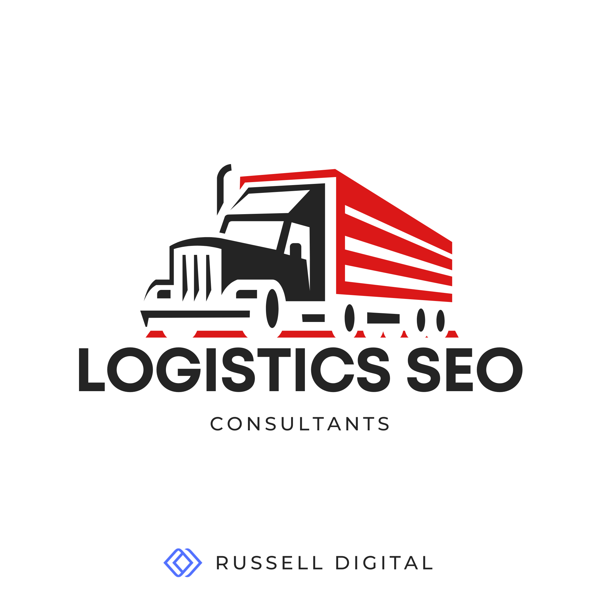

Look, if you're one of the many logistics companies out there in 2026 and your website isn't pulling in organic traffic, you're basically invisible. And I don't mean "kind of hard to find" invisible, I mean your competitors are literally taking the leads that should be yours because they showed up on page one and you didn't. Whether we're talking logistics SEO or transportation SEO (search engine optimization) more broadly supply chain, the game is the same: if shippers can't find you online, they're finding someone else.

That's what a logistics SEO consultant like Russell Digital does. We fix that.

But here's the thing — not every SEO agency understands the logistics industry. And hiring the wrong one can waste months of your time and thousands of dollars. So let's break down what actually matters when you're looking for SEO help in this space, what services to expect, and how to tell whether a consultant is worth their retainer.

## What Even Is Logistics SEO (and Why It's Different from Regular SEO)

SEO for logistics companies — or really any transportation SEO niche — isn't the same as optimizing a local bakery or an ecommerce store. The search engine optimization fundamentals are similar, sure. Keywords, link building, technical SEO, content. But the strategy behind all of it has to account for a few things that are pretty unique to this industry.

For starters, you're usually dealing with B2B search intent. The person typing queries into Google isn't looking for a quick purchase. They're a supply chain manager evaluating freight partners, or a procurement lead comparing 3PL providers. The sales cycle is long. The decision involves multiple stakeholders. And the keywords that actually convert — things like "LTL freight shipping midwest" or "cold chain logistics provider" — are way more specific than what most generalist SEO agencies are used to targeting.

Then there's the complexity of the sites themselves. Logistics companies often have dozens (sometimes hundreds) of service area pages, route-specific landing pages, mode-of-transport breakdowns like air freight vs sea freight vs ground — all of which need to be structured in a way that Google can crawl and index efficiently. Most agency playbooks just aren't built for that.

A good logistics SEO consultant gets this. They understand the difference between how a pharmaceutical 3PL operates versus a general freight broker, and they build the SEO strategy around the actual business — not some cookie-cutter template.

## The SEO Services You Should Expect from a Logistics Consultant

When you're vetting SEO services for a logistics company, there's a baseline set of deliverables that any decent consultant should bring to the table. If they can't speak to all of these, that's a red flag.

**Keyword Research That Actually Reflects Your Market**

This is where most engagements go sideways early. A consultant who doesn't understand logistics will chase high-volume vanity keywords that sound impressive in reports but don't generate qualified leads. What you actually need is keyword research focused on commercial intent — terms that shippers, freight brokers, and supply chain directors are using when they're ready to evaluate vendors.

That means going beyond "logistics company" and targeting phrases tied to specific services, routes, industries, and pain points. Think "refrigerated trucking southeast US" or "freight audit services for retail." That's where the real organic traffic comes from in this space.

## Technical SEO for Large-Scale Logistics Sites

This deserves its own section because logistics sites are a different beast. Most logistics companies have websites that were designed to reassure existing clients, not attract new ones. The navigation is confusing, load times are slow, and search engines can barely crawl half the pages. Technical SEO fixes this — but the scale of the problem on large logistics sites is something a lot of generalist consultants underestimate.

We're talking about core web vitals optimization, crawl health audits, proper XML sitemaps, fixing broken links, schema markup for your services and contact info, and making sure the site architecture actually makes sense for both users and Google.

For logistics companies with hundreds of service area pages — say you cover 40 metro areas across three service types — the site structure has to be airtight. Flat architectures where every page is two clicks from the homepage. Clean URL structures that reflect the service hierarchy. Internal linking strategies that pass authority from your strongest pages down to the long-tail service area pages that actually convert.

If your logistics company operates internationally, theres also the question of how to structure the site — subdomains, subdirectories, or separate country-level domains. Each approach has tradeoffs around crawl budget, link equity consolidation, and geo-targeting signals. A consultant who specializes in this industry will have opinions here (and they should). They should also be able to handle hreflang implementation without creating a mess of conflicting signals, which is honestly where a lot of international SEO projects go sideways.

Inventory and dynamic content is another thing. If your site pulls in real-time availability, tracking portals, or equipment databases, you need to make sure Google can still access and index the static content around it. JavaScript-heavy logistics platforms are notorious for hiding content behind client-side rendering that search engines never see.

### Link Building That Builds Real Authority

Link building in logistics isn't about blasting guest posts across random blogs. It's about earning backlinks from industry publications, trade associations, supply chain media outlets, and relevant business directories. These are the links that actually build authority and trust with search engines.

The logistics industry has some great opportunities here — trade organizations, freight industry publications, supply chain conferences — but you need a consultant who knows where to look and how to pitch. If someone's offering you 50 links a month from sites you've never heard of, run.

### Keyword Research that Delivers SEO Content That Speaks to Decision Makers

Content marketing for logistics is not about churning out blog posts for the sake of it. It's about creating genuinely useful pages that answer the specific questions your target audience is asking. That means service pages with real depth, not thin keyword-stuffed placeholders. Route pages that provide actual information about shipping corridors. Case studies that show results. Thought leadership that positions your company as an expert in its niche.

The SEO content needs to hit at every level of the funnel — from broad educational pieces about supply chain optimization down to bottom-funnel comparison pages that help prospects choose between providers.

### Local SEO for Regional Logistics Operations

If your logistics company serves specific regions or operates out of particular hubs, local SEO is non-negotiable. That means optimizing your Google Business profile, building citations in local and industry directories, creating location-specific landing pages, and making sure your NAP (name, address, phone) data is consistent across the web.

A lot of logistics companies skip this because they think of themselves as "national" or "global" — but the reality is that many of your best leads are searching with local intent. "Warehousing services near Dallas" or "freight broker Houston" are real queries with real commercial value.

## AI-Driven Search and How Logistics Companies Should Adapt Their SEO Strategy

Okay so this is something a lot of logistics companies aren't paying attention to yet, and honestly, it's a massive opportunity for the ones who move fast.

The data on this is pretty wild. Recent research shows that roughly 73% of B2B buyers are now using AI tools like ChatGPT and Perplexity as part of their vendor research process. And it's not just younger buyers — adoption is broad. For the logistics industry specifically, this means the procurement managers and supply chain directors evaluating your services might be asking an AI tool to recommend freight partners before they ever touch Google.

Here's where it gets interesting for SEO. AI models tend to cite content that is data-rich, well-structured, and genuinely authoritative. Generic marketing copy about being a "leading logistics solutions provider" doesn't get cited. Specific, detailed content about your actual capabilities, routes, certifications, and pricing frameworks does.

Brand mentions across the web correlate significantly more with AI citation than traditional backlinks do. So the logistics companies that are publishing real thought leadership, getting mentioned in industry publications, and maintaining detailed structured data on their sites are the ones showing up in AI-generated answers.

Most SEO consultants haven't caught up to this yet. If you're interviewing logistics SEO consultants, ask them about their approach to AI search visibility and generative engine optimization. If they look at you blankly, they're already behind.

## Conversion Rate Optimization: Turning Logistics Traffic Into Actual Leads

Here's something that drives me a little crazy. Companies will spend $5k-10k a month on SEO, start getting more organic traffic, and then wonder why their leads didn't increase proportionally. Nine times out of ten, the issue is their website isn't optimized to convert that traffic into actual quote requests, calls, or form submissions.

Conversion rate optimization is the bridge between rankings and revenue. For logistics companies, this means clear calls to action on every service page. Quote request forms that aren't buried three clicks deep. Trust signals like certifications (ISO, AEO, HAZMAT, whatever applies to your niche), client logos, and case studies placed where prospects actually see them. Fast page loads — because if an operations manager is checking your site on mobile between meetings and it takes 5 seconds to load, they're gone.

A good logistics SEO consultant doesn't just get you traffic. They make sure that traffic converts. If your consultant isn't talking about conversion rate optimization, they're only doing half the job.

### What Freight Broker SEO Looks Like Specifically

Worth calling out separately because freight brokers have their own unique SEO challenges. The freight broker space is incredibly competitive online — large aggregator sites and established brokerages tend to dominate a lot of the high-value keywords.

For a freight broker, SEO strategy usually needs to lean heavy into niche specialization. Instead of trying to rank for "freight broker" (good luck competing with the big directories on that), you target specific lanes, freight types, and industries. "Reefer loads Texas to California" or "flatbed freight broker for construction materials" — these are the kinds of long-tail terms where smaller brokers can compete and actually convert.

The content strategy for freight brokers should also emphasize trust and transparency — shipper education content, rate trend analyses, carrier vetting processes, that kind of thing. The goal is to position the broker as a knowledgeable partner, not just a middleman.

## Frequently Asked Questions About Logistics SEO Consultants

### How much do logistics SEO services cost? What are the common SEO pricing models?

Let's be real about this because I know it's one of the first things people want to know and almost no one gives straight answers.

SEO pricing for logistics companies varies a ton based on the size of your site, your competitive landscape, and the scope of work. But here's a rough framework so you're not walking into conversations blind.

Most legitimate logistics SEO consultants and agencies charge on a monthly retainer basis. For a small to mid-size logistics company, you're typically looking at somewhere in the range of $3,000 to $8,000 per month for a comprehensive SEO engagement. Larger enterprises with complex international sites and aggressive growth targets can easily spend $10,000 to $20,000+ monthly.

Some consultants also offer project-based pricing — say, a one-time technical SEO audit for $2,000-$5,000, or a content strategy buildout as a standalone deliverable. And then there's the hourly model, which usually runs $150-$300/hour for experienced logistics SEO consultants. Hourly works best for advisory roles where you have an internal team doing the execution.

Be skeptical of anyone quoting you under $1,000 a month for "full SEO services." At that price point, you're either getting automated reports with no real strategy, or the work is being outsourced to people who have zero understanding of the logistics industry.

### What kind of ROI should I expect from logistics SEO?

This is the question that actually matters more than price, honestly. A good consultant should be able to explain how they measure success beyond just rankings. You want to see metrics tied to actual business outcomes: increases in qualified leads, quote request volume, organic traffic from target service areas, and ultimately, revenue growth.

The timeline for meaningful results in logistics SEO is usually 3 to 6 months for initial traction, with compounding returns over 12 to 18 months. SEO leads in B2B tend to close at significantly higher rates than outbound leads — some industry data puts it around 14% vs under 2% — so even modest traffic gains can translate to real revenue if your site is converting properly.

Ask any prospective consultant to walk you through their ROI benchmarks from similar engagements. If they can't give you specifics, thats a sign they're not tracking the right things.

### How long does it take for logistics SEO to start working?

Depends on where you're starting from. If your site has major technical issues — broken crawl paths, no indexation strategy, zero content — you might not see movement for 3-4 months while the foundation gets built. If you've got a decent site that just needs better optimization and content, you could start seeing ranking improvements within 6-8 weeks.

The honest answer is that SEO is a compounding investment. Month one doesn't look like much. By month six you're seeing real traction. By month twelve, organic search should be one of your top lead sources if the strategy is solid.

## How to Choose the Right Logistics SEO Agency or Consultant

There's a lot of SEO agencies out there that will slap "logistics" onto their services page the minute you inquire. Here's how to separate the real ones from the posers:

**Ask about their logistics clients.** Not just "B2B clients" — actual logistics, freight, transportation, or supply chain companies. If they can't name specific examples or show relevant case studies, they're going to be learning on your dime.

**Look at their own SEO.** Seriously. If an SEO consultant can't rank their own website, why would you trust them with yours? Check if they show up for relevant terms. Look at their content quality. Is it thoughtful and specific, or is it generic fluff?

**Understand their approach to technical SEO.** Logistics sites have complex architectures. Ask how they'd handle your service area pages, international targeting, site speed optimization, and schema markup. If they can't get specific, they probably haven't done it before.

**Evaluate whether they think beyond Google.** The best SEO consultants in 2026 are already thinking about AI search visibility, voice search, and how content needs to be structured for multiple discovery channels — not just traditional organic rankings.

**Check their reporting.** Monthly reports should include more than just keyword positions. You want to see traffic trends, lead attribution, conversion data, and clear next steps. If the reports are just pretty charts with no actionable insights, you're paying for decoration.

## Generating Leads Beyond Organic: Digital Marketing and SEO Working Together

SEO doesn't exist in a vacuum. The most effective logistics companies pair their organic search strategy with complementary digital marketing efforts — PPC for immediate visibility while SEO ramps up, content marketing across LinkedIn and industry publications, email nurture sequences for leads that aren't ready to convert yet.

A logistics SEO consultant who understands the broader digital marketing landscape can help you build an integrated strategy where every channel reinforces the others. Your blog content feeds your social media presence. Your SEO research informs your paid search targeting. Your link building efforts double as PR and brand awareness campaigns.

That said — don't let an agency use "integrated marketing" as an excuse to spread your budget so thin that nothing works properly. SEO should be the foundation. Everything else builds on top of it.

## The Bottom Line

If you're in logistics and you're not investing in SEO, you're leaving money on the table. Full stop. The companies that are ranking right now are capturing leads that should be going to you. And with AI search adding another layer of complexity to how B2B buyers discover vendors, the window to establish your online visibility is narrowing.

Find a logistics SEO consultant who actually understands your industry. Make sure they're focused on driving real business results, not just vanity metrics. And give the strategy enough time and resources to actually work.

The ROI is there. You just need the right partner to help you capture it.

- - -

*Looking for SEO solutions tailored to logistics and supply chain businesses? The right consultant can mean the difference between digital growth and digital invisibility. Start with [Russell Digital](https://russelldigitalads.com/free-strategy-call/), our free strategy call can help you find the gaps in your website..*
