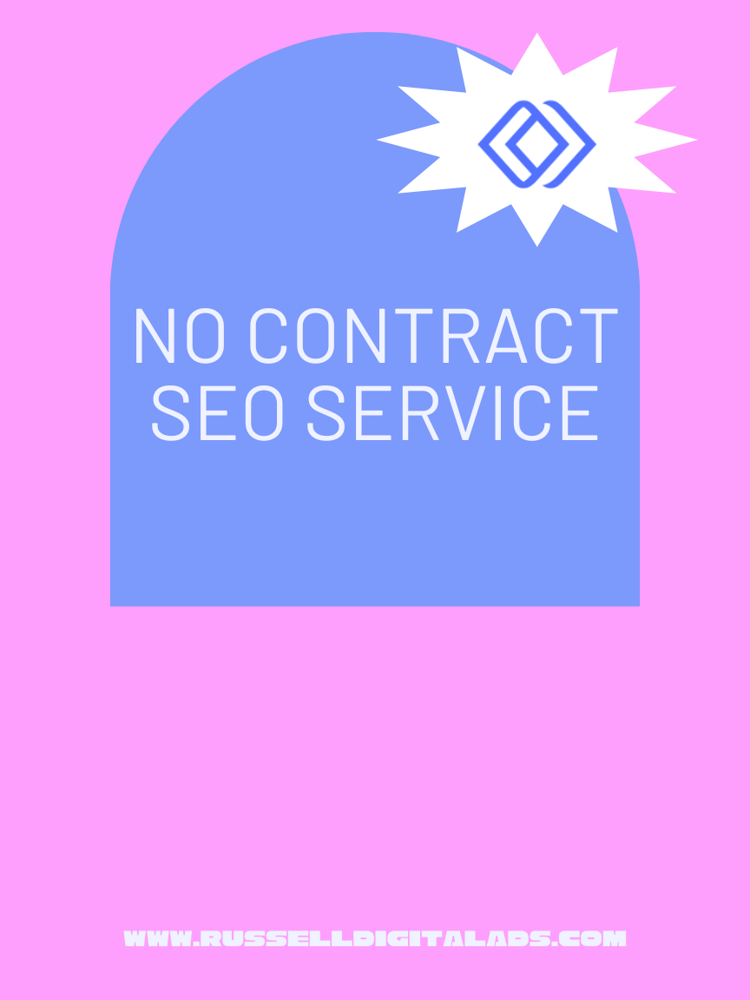

Most SEO agencies still ask for a 6-month or 12-month contract before doing a single hour of work. That model made sense when SEO was slow, opaque, and expensive to deliver. It makes a lot less sense in 2026, when businesses want flexibility, faster feedback loops, and providers who earn the next month instead of locking in the next year.

No contract SEO is the alternative. It's search engine optimization delivered on a month-to-month basis, with no long-term commitment, so your business keeps the leverage. If the work is producing results, you stay. If it isn't, you leave. This guide explains how the model works, where it beats a traditional retainer, where it can fall short, and how to evaluate agencies that offer it — so digital marketing spend goes toward real growth instead of a legal obligation.

## What No Contract SEO Services Actually Mean

A "no contract" SEO engagement is still a professional agreement — you'll sign a scope of work that spells out deliverables, payment terms, and cancellation policy. What's missing is the multi-month commitment. Instead of locking you into 12 months at $3,000 per month, the agency bills you monthly and you can cancel with short notice (typically 30 days).

Under this model, an SEO company delivers the same core services you'd get from a traditional agency: technical audits, on-page optimization, content production, internal linking, local search engine optimization, and reporting. The deliverables don't change. The commercial terms do. You're not paying for a promise about next year — you're paying for work this month, and the agency has to keep earning the renewal.

The defining feature is mutual accountability. A contract SEO arrangement can let an agency coast after the first quarter, because the revenue is already locked in. Under a no contract structure, the agency knows you can walk at any time, so the pressure to show monthly progress stays high. That's the whole idea.

## How No Contract SEO Differs From a Traditional SEO Retainer

A traditional SEO retainer typically runs 6 to 24 months. It usually includes a larger upfront scope — sometimes a full site migration, an aggressive link-building program, or deep technical work that compounds over a long timeline. The agency can allocate more resources upfront because they know the revenue is guaranteed.

No contract SEO trades some of that long-horizon commitment for flexibility. Month-to-month work tends to focus on the highest-leverage activities first — publishing consistently, fixing technical issues in priority order, strengthening service pages, and building local relevance. The strategy is still long term in spirit (SEO always is), but the commercial arrangement is short term.

Industry pricing in 2026 for legitimate monthly SEO work typically lands between $1,500 and $5,000 per month for small-to-midsize businesses, with local campaigns often starting lower and national campaigns climbing higher. Be skeptical of monthly fees under $500. At that price, you're almost always paying for templated work, low-quality links, or offshore execution that can damage rankings rather than improve them.

## Performance-Based SEO and the Results-First Mindset

Performance-based SEO is often used as a synonym for no contract SEO, and the overlap is real. Both models put the focus on results rather than retention clauses. The agency's incentive is to produce measurable improvement — rankings, qualified organic traffic, leads — because that's what keeps you renewing.

This isn't the same as "pay only when you rank," which is usually a red flag (nobody can guarantee Google rankings, and agencies that promise to are almost always using risky tactics). True performance-based thinking just means the agency ties its monthly work to outcomes you can see: movement on target keywords, growth in organic sessions, improvements in conversion-ready pages, and clear reporting on what shifted and why.

The strategy of a performance-oriented SEO agency tends to be tighter. Instead of sprawling 40-page roadmaps, you get a short list of priorities each month with clear rationale. The work is supposed to matter. If something is on the list only because it pads the invoice, it gets cut.

## The Benefits of No Contract SEO for Your Business

The advantages show up quickly when the model is executed well:

* **Flexibility.** Budgets change, priorities shift, and markets move. A flexible monthly arrangement lets you scale up, scale down, or pause without legal friction.
* **Urgency.** The agency has to earn the renewal every month. That usually translates into faster execution and better communication.
* **Transparency.** No contract providers tend to over-communicate by necessity. You'll see monthly reports, clear deliverables, and an honest read on what's working.
* **Lower risk of mismatch.** If the agency is wrong for your industry or your team, you discover it in month one or two — not month eight.
* **Alignment with SEO reality.** Search is volatile. Algorithm updates and AI-driven changes to search results reshape strategy often. A monthly model lets the work adapt instead of running a locked-in plan that's already out of date.

For service businesses and growing brands, this is usually the right trade. You need search to become a real acquisition channel, and you need to feel confident in the company doing the work.

## The Risks and Limitations of No Contract SEO

A balanced view of no contract SEO has to include the downsides, because the model isn't perfect.

**Short-term thinking can crowd out long-term strategy.** SEO compounds over 6 to 18 months. If an agency is worried about next month's renewal, they may lean toward quick wins and skip deeper technical work, authority building, or content investments that pay off later. That's a real risk worth discussing with any provider.

**Resource allocation is more limited.** Because the agency can't predict long-term revenue, they usually can't dedicate the same upfront resources a contract retainer would. Large-scale migrations, aggressive link campaigns, or deep content programs may need a longer commitment to execute well.

**Inconsistent effort from low-quality providers.** Not every no contract agency is good. Some use the "no contract" label as marketing while delivering minimal work, betting that you won't notice for a few months. The model rewards disciplined agencies and exposes lazy ones, but you still have to vet.

**Easier to quit on SEO too early.** SEO performance is rarely linear. There will be months where rankings dip, traffic flattens, or nothing visible changes — while the foundation you're building quietly gains strength. Flexibility can become a liability if you abandon a good strategy before it has time to compound.

The honest answer: no contract SEO is an excellent model for the right business, paired with the right agency. It's not automatically better than a retainer. It's a different trade-off.

## How to Evaluate a No Contract SEO Agency

Because the barrier to entry is low, the quality spread among no contract SEO companies is wide. Use these criteria to separate serious providers from filler.

### Scope and Deliverables

Ask exactly what's included each month. How many articles? How much technical work? What does "optimization" actually mean? A legitimate agency will answer clearly. Vague promises like "we'll improve your visibility" without specifics are a red flag across every SEO engagement, but especially when no contract is in place.

### Reporting and Transparency

You should receive regular reports covering rankings, organic traffic quality, conversions from search, and implementation status. Ideally, you get direct access to Google Search Console and Google Analytics rather than filtered dashboards. Transparency is the whole point — if the agency is protective about what they're doing, that defeats the model.

### The SEO Audit Process

A credible engagement starts with a real SEO audit: technical health, indexation issues, ranking gaps, content weaknesses, and highest-value opportunities. An audit that produces a prioritized list tells you the agency thinks in terms of impact. An audit that produces a 60-page PDF of generic findings tells you they don't.

### Cancellation Policy

The cancellation policy should be short and specific. Most reputable no contract agencies ask for 30 days' notice, which is fair — it lets them wind down open work cleanly. Watch for hidden fees, mandatory buy-backs of content, or clawbacks on deliverables. You should own your site, your content, and your data when you leave.

### Track Record With Your Industry

Results in your industry matter more than results in general. An agency that dominates in local home services may struggle with SaaS, and vice versa. Ask for specific, relevant case studies — not just logos on a wall.

### Honest Limits

Good SEO people tell you what SEO can't do in your timeframe. An agency that promises page-one rankings in 30 days is either naive or lying. An agency that tells you the first quarter will be foundational and meaningful gains usually start in months 3–6 is being straight with you.

## Transitioning From a Long-Term Contract to No Contract SEO

If you're currently in a contract SEO arrangement and it isn't working, you're not stuck — but you should transition thoughtfully. A few practical steps:

1. **Review your current agreement.** Check the cancellation terms and any notice period. Some contracts have exit windows; others have buyout clauses.
2. **Document what you own.** Make sure you have direct access to your Google Search Console, Google Analytics, Google Business Profile, and any content or assets produced during the engagement. Export historical reports.
3. **Get a second-opinion audit.** Before switching, have a potential new partner audit your site. This tells you what state it's actually in and whether the previous agency's work holds up.
4. **Run a brief overlap.** If possible, line up the new no contract provider before your current agreement ends. Continuity matters for SEO performance — gaps in publishing, technical maintenance, or link maintenance can undo progress.
5. **Set clear goals for the new engagement.** Start with specific monthly outcomes: keywords to track, pages to improve, content to publish. A clear scope in month one prevents drift later.

This isn't a permanent switch for every business. Some companies eventually move back to a longer retainer once trust is built. The point is to have the option.

## Where Russell Digital Fits

Russell Digital offers SEO services on a month-to-month basis. There's no long-term lock-in, the monthly deliverables are clear, and the focus is on the work most likely to improve visibility first — then building a stronger SEO foundation from there. Two plans: a Starter SEO retainer for businesses that want consistent monthly momentum, and a Growth SEO plan built around one SEO article every business day for companies that want a real organic engine rather than occasional blog posts.

The approach is technical-first, conversion-aware, and intentionally plain-spoken: every recommendation has a reason behind it, the reporting is understandable, and the goal is better search performance tied to business outcomes. If you want a cleaner site, stronger rankings, and an SEO plan tied to actual goals — without being locked into a year you can't exit — that's exactly what this model is designed for.

## Frequently Asked Questions

### Is SEO dead or evolving in 2026?

SEO isn't dead — it's evolving, quickly. The fundamentals (useful content, clean technical structure, authoritative signals, search intent match) still drive visibility. What's new is the surface area. Search results now include AI Overviews, answer engine results, and entity-based retrieval in tools like ChatGPT. Good SEO in 2026 means optimizing for classic search and AI-assisted search simultaneously, with cleaner information architecture and clearer content. The discipline is expanding, not disappearing.

### Is SEO dead now with AI?

No. AI has changed how some queries get answered, particularly short informational ones that now resolve inside a summary box. But commercial, local, and high-intent searches still drive the clicks that matter to most businesses — and AI answer engines themselves pull from well-optimized pages. SEO work that focuses on clear entities, structured content, and answer-ready formatting is currently outperforming the old keyword-stuffing approach. AI didn't kill SEO; it raised the quality bar.

### What are the 4 types of SEO?

The four commonly cited types are: **on-page SEO** (optimizing content, headings, internal linking, and page-level signals), **technical SEO** (crawlability, indexation, site speed, schema, core web vitals), **off-page SEO** (backlinks, citations, brand mentions, and external authority signals), and **local SEO** (Google Business Profile, local landing pages, map pack visibility, and location-specific relevance). A strong SEO strategy uses all four in combination, not one in isolation.

### How long does SEO take to show results?

Expect 3 to 6 months for meaningful movement on competitive terms, and 6 to 12 months for compounding gains. Some wins come earlier — fixing technical issues or optimizing existing pages can produce short-term lifts — but the real value of SEO comes from sustained execution over time.

### Do no contract SEO agencies still ask you to sign anything?

Yes, and that's normal. You'll sign an agreement that defines scope, deliverables, payment terms, and cancellation policy. What you're not signing is a multi-month commitment. Any agency that skips the agreement entirely is a warning sign, not a feature.

## Build Search Into a Real Growth Channel

No contract SEO works when the agency is good, the scope is clear, and both sides are focused on monthly performance. It's the model that tends to produce the most urgency, the most transparency, and the most honest conversations about what search can actually deliver for your business.

If you want a clearer view of where your site stands, what's holding it back, and where the best search opportunities are, start with a free audit. That's the right first step whether you end up engaging month-to-month or not — because you can't make a smart decision about SEO until you understand the state of the asset you're trying to grow.

- - -

&nbsp;
