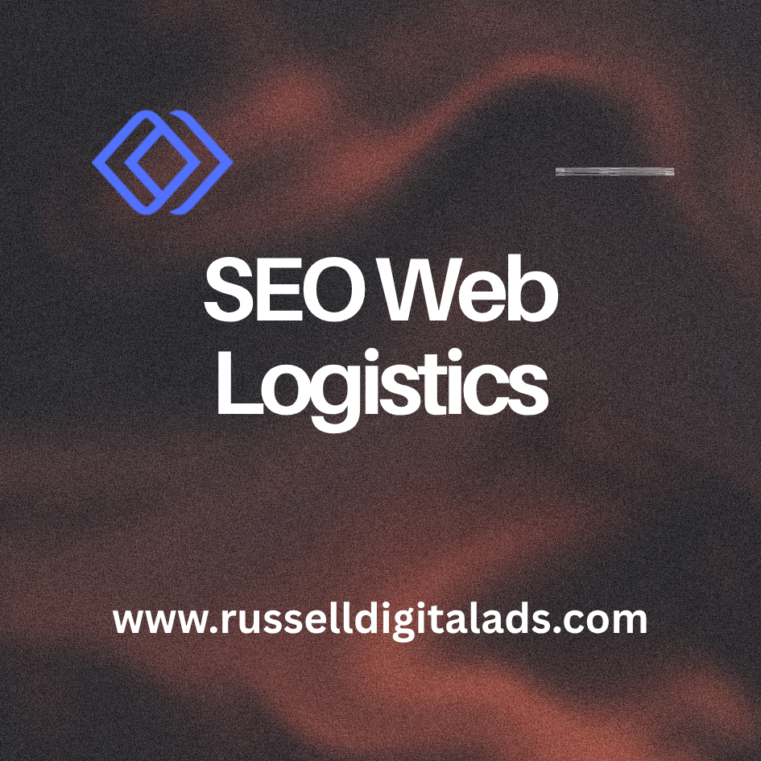

Logistics companies have strong operations, reliable fleets and years of experience. But none of that matters if potential customers can't find you online. SEO web logistics is about making sure your company shows up when someone searches for the services you offer. Whether that's freight forwarding, warehousing, 3PL or supply chain management.

This article covers the SEO strategy, content and technical tactics that help logistics companies turn search engine optimization into a real lead generation channel. We'll also cover how to adapt for AI-driven search and what most agencies get wrong about B2B SEO in the logistics industry.

## SEO Strategy for Logistics Companies

A good SEO strategy for a logistics company starts with understanding how your buyers actually search. Most logistics decisions are B2B, meaning the search behavior is completely different from consumer products. Decision-makers are searching for specific services, routes, capabilities and locations.

Your strategy needs to match that. Rather than going after broad terms like "logistics services" you should be targeting specific keyword phrases like "LTL freight shipping Houston to Dallas" or "cold chain warehousing near me." These are the queries that come from people ready to request a quote or make a call.

The best approach is to build your site around service pages and location pages that target these keywords directly. Then support them with blog content that builds your brand authority over time and drives organic traffic from informational searches.

## Keyword Research for the Logistics Industry

Keyword research is where the entire strategy starts. You need to know what your potential customers are typing into Google before you can optimize for it.

For logistics companies this usually falls into a few categories:

* **Service keywords** like "freight forwarding" or "warehousing services"
* **Location keywords** like "logistics company in \[city]" or "freight broker near me"
* **Long-tail keywords** that match specific services such as "refrigerated LTL shipping midwest" or "ecommerce fulfillment for small business"

The biggest mistake we see is logistics companies targeting keywords that are too broad. Ranking for "logistics" is nearly impossible and even if you did it wouldn't bring the right traffic. Focus on the keywords that match your actual services and the markets you serve.

## Content Strategy That Drives Rankings and Sales

Content is what makes SEO work long term. Every page on your site is an opportunity to rank for a keyword and convert a visitor into a lead.

For logistics companies we recommend building content in three tiers:

**Service pages** that target your core commercial keywords. These pages should explain what you do, who it's for, where you operate and include a clear call to action. Each service you offer should have its own dedicated page.

- - -

**Location pages** for every market you serve. If you operate in 10 cities you need 10 location pages. Each one should be unique and specific to that area, not just the same template with the city name swapped out.

- - -

**Blog content** that answers the questions your potential customers are asking. Things like "how to choose a 3PL provider" or "LTL vs FTL shipping explained." This type of content builds trust and brings in organic traffic from people at the top of the funnel.

The key is consistency. Publishing one blog post and waiting for results won't work. You need to be putting out useful content on a regular basis so search engines see your site as an active authority in the logistics space.

## Case Studies as SEO Assets

Most logistics companies have case studies sitting in a PDF somewhere that nobody ever sees. That's a missed opportunity.

Case studies are some of the best content you can have on your site for SEO. They target commercial keywords naturally, they demonstrate results and they build trust with potential customers who are evaluating providers.

Take your best client results and turn them into dedicated web pages. Include the challenge, what you did and the outcome. Use real numbers where possible. A page titled "How We Reduced Shipping Costs by 30% for a Regional Retailer" will rank for relevant keywords and convert visitors at a much higher rate than a generic services page.

## Local SEO for Logistics Firms

If your business serves specific geographic regions then local SEO is critical. This is what determines whether you show up in Google Maps and the local pack results when someone searches for logistics services in your area.

The foundation of local SEO is your Google Business Profile. A lot of logistics companies either don't have one or set it up years ago and never touched it again.

### Google Business Profile Optimization

Here's what you need to do with your Google Business Profile:

1. Make sure your business name, address and phone number are accurate and consistent across every directory
2. Choose the right primary and secondary categories for your services
3. Write a keyword-rich business description that explains exactly what you do and where
4. Add photos of your facilities, fleet and team
5. Post updates regularly with news, case studies or service announcements
6. Ask satisfied customers to leave reviews and respond to every one

Your Google Business Profile feeds directly into Google Maps, Google Search and increasingly into AI-generated answers. Keeping it optimized is one of the highest-impact things you can do for local visibility.

## Lead Generation Through SEO

The entire point of SEO for a logistics company is lead generation. More visibility means more traffic and more traffic to the right pages means more quote requests, phone calls and form submissions.

But this only works if your site is actually built to convert. That means clear calls to action on every page, a simple quote request form that doesn't ask for 15 fields and fast page load times so visitors don't bounce before they even see your services.

The companies that get the most out of SEO are the ones that treat their website as a sales tool, not a digital brochure.

## B2B SEO for Logistics

B2B SEO is different from B2C in a few important ways. The sales cycle is longer, the decision-making process involves multiple people and the keywords tend to be more specific and technical.

For logistics companies this means your content needs to speak to operations managers, procurement directors and supply chain leads. Not consumers. Your tone should be professional but direct and your content should demonstrate that you actually understand the problems your prospects are trying to solve.

B2B SEO also means longer content isn't always better. A 500-word page that directly answers the searcher's question and makes it easy to take the next step will outperform a 3,000-word article full of filler.

## E-E-A-T for Logistics Providers

E-E-A-T stands for Experience, Expertise, Authoritativeness and Trustworthiness. Google uses it to evaluate the quality of content, and it matters a lot for logistics companies.

When someone searches for a logistics provider they're making a decision that affects real shipments, real timelines and real money. Google knows this. That's why logistics sites with thin content and no proof of expertise consistently get outranked by sites that demonstrate real industry knowledge.

Here's how to build E-E-A-T on your logistics site:

* **Experience:** Publish case studies, client results and real operational data
* **Expertise:** Have content written or reviewed by people with actual logistics experience. Put author bios on your blog posts with real credentials
* **Authoritativeness:** Get mentioned in industry publications, logistics trade media and partner websites
* **Trustworthiness:** Display certifications, years in business, client logos and reviews prominently on your site

This isn't optional. It's the baseline for ranking in a competitive B2B industry.

## Answer Engine Optimization (AEO)

SEO in 2026 isn't just about Google's traditional search results anymore. AI-generated answers from Google AI Overviews, ChatGPT and Perplexity are changing how buyers find and evaluate logistics providers.

Answer engine optimization is about structuring your content so that AI models can extract and cite it in their responses. For logistics companies this means a few things:

* Write direct-answer paragraphs at the top of key pages that answer the query in 40-50 words before any heading
* Use FAQ schema on pages that answer common questions
* Keep your business entity data consistent across every directory and listing
* Build SERP features like featured snippets by using question-format headings and structured content

The logistics companies that are visible in both traditional search results and AI-generated answers will have a significant advantage over those still focused only on rankings.

## Frequently Asked Questions

### What is SEO in logistics?

SEO in logistics is the process of optimizing a logistics company's website so it ranks higher in search engines for the keywords potential customers are using. This includes technical optimization, keyword research, content creation and link building, all focused on the logistics industry. The goal is to drive organic traffic that turns into qualified leads.

### How long does logistics SEO take to show results?

Most logistics companies start seeing measurable improvements in rankings and traffic within 3-6 months. Competitive keywords in the logistics industry can take longer. The important thing is that SEO compounds over time, so the results get better the longer you invest in it.

### What makes logistics SEO different from regular SEO?

Logistics SEO is B2B focused and targets technical, service-specific keywords that regular SEO agencies often miss. The search behavior of procurement directors and operations managers is very different from consumer search, so the keyword strategy, content approach and site structure all need to reflect that.

## Get Found by the People Already Searching for Your Services

Russell Digital helps logistics companies, freight forwarders and supply chain businesses build search visibility that turns into real leads. No bloated retainers and no vague reporting, just clean strategy and fast execution tied to actual business results.

[Book a Strategy Call](https://russelldigitalads.com/free-strategy-call/)
