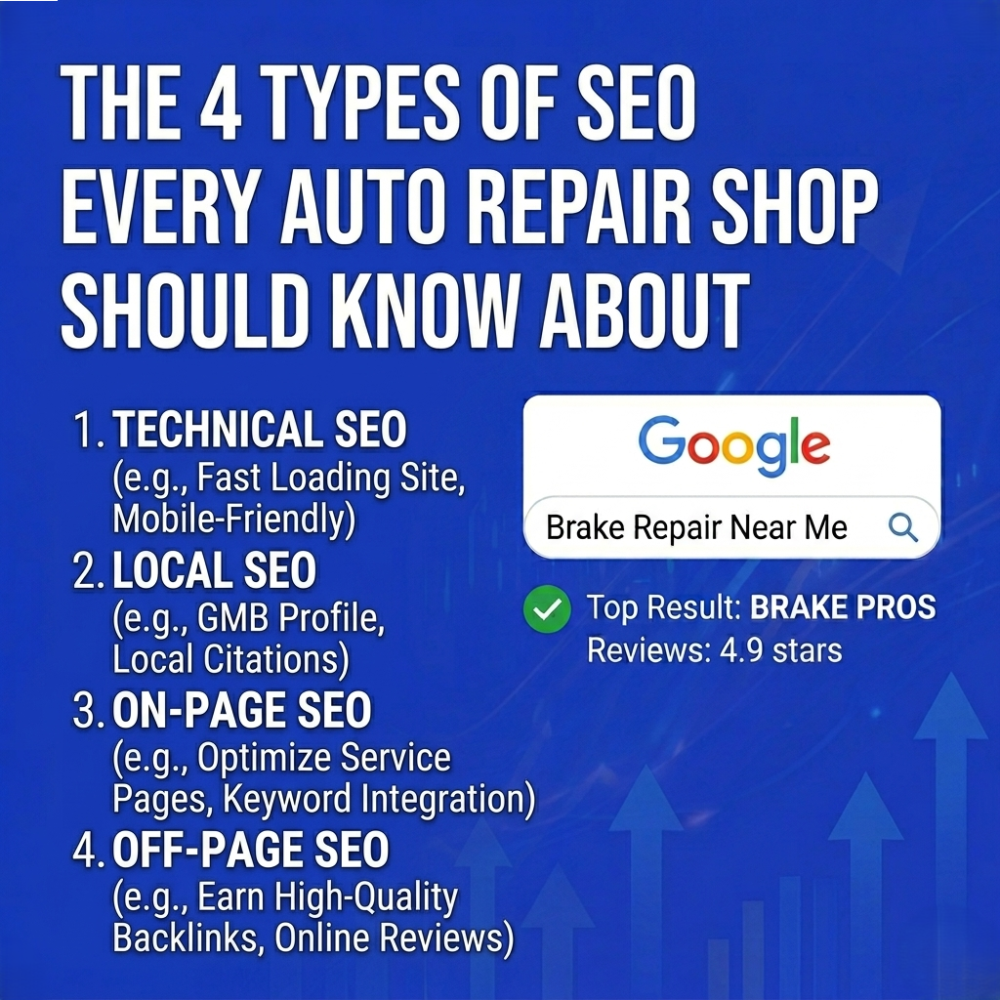

When most auto repair shop owners hear "SEO," they think it's one thing — maybe stuffing keywords into a website or paying someone to "do the Google stuff." In reality, search engine optimization breaks down into four distinct types, and understanding each one is the difference between a shop that gets found online and one that doesn't.

Here's the breakdown, written for shop owners, not marketing nerds.

- - -

## 1. Local SEO — The One That Matters Most

If you only invest in one type of SEO for your brake repair shop, make it **local SEO**.

Local SEO is how you show up in Google Maps, the local 3-pack (those three business listings that appear at the top of local searches), and "near me" queries. When someone in your city types "brake repair near me" or "auto shop in \[neighborhood]," local SEO determines whether your shop appears or not.

The key components of local SEO:

Your **Google Business Profile** is the foundation. It needs to be claimed, verified, and fully completed — hours, services, photos, categories, and a compelling description. Google heavily favors profiles that are active and complete.

**NAP consistency** means your Name, Address, and Phone number are identical everywhere they appear online — your website, Yelp, the Better Business Bureau, Facebook, and every other directory. Even small mismatches (like "Street" vs "St.") can hurt your rankings.

**Online reviews** are one of the strongest local ranking signals. A steady stream of genuine positive reviews from happy customers tells Google your shop is trustworthy and active.

**Local citations** — mentions of your business on directories and local websites — build credibility across the web.

## 2. On-Page SEO — What's Actually On Your Website

On-page SEO is everything a visitor (and Google's crawlers) can see on your website. It's the content, the structure, and the way information is organized.

For auto repair shops, on-page SEO means having **dedicated service pages** for each service you offer. A single "Services" page that lists brake repair, oil changes, transmission work, and diagnostics in a paragraph isn't going to rank for any of those terms individually. Each service needs its own page with relevant keywords, a clear description, pricing information (if possible), and a call to action.

Other on-page essentials include optimized title tags and meta descriptions that include your service and city, a logical header structure (H1, H2, H3), internal links between related pages, and image alt text that describes what's in the photo.

Your website content should answer the questions your potential customers are actually asking: "How much does brake repair cost?" "How long does it take to replace brake pads?" "What are signs I need new brakes?" Each of these is a ranking opportunity.

## 3. Technical SEO — The Stuff Under the Hood

Think of technical SEO like the engine of your car — your customers never see it, but everything falls apart if it's not working right.

Technical SEO covers the behind-the-scenes elements that affect how Google crawls, indexes, and ranks your site. The biggest factors for auto repair shops:

**Page speed.** If your website takes longer than 3 seconds to load on a phone, you're losing visitors and Google is penalizing your rankings. Compress images, minimize code, and use a decent hosting provider.

**Mobile-friendly design.** More than half of local searches happen on mobile devices. Your site needs to look great and function smoothly on every screen size. Google uses mobile-first indexing, meaning the mobile version of your site is what gets evaluated for rankings.

**Schema markup.** This is structured code that tells Google exactly what your business is, where it's located, what services you offer, and what customers think of you. Adding `LocalBusiness` and `AutoRepair` schema to your site can improve how you appear in search results — including rich snippets with star ratings, hours, and pricing.

**Site architecture.** A clean URL structure and logical navigation help Google understand the relationship between your pages. Your homepage should link to main service categories, which link to specific service pages.

## 4. Off-Page SEO — Your Reputation Beyond Your Website

Off-page SEO is about what the rest of the internet says about your shop. It's the digital equivalent of your reputation in the community — and it carries serious weight with Google.

**Backlinks** are the backbone of off-page SEO. When another website links to yours, Google treats it as a vote of confidence. Links from local chambers of commerce, industry blogs, community organizations, and local news sites are especially valuable for auto repair shops.

**Social media** presence doesn't directly impact rankings, but it reinforces your brand and drives traffic to your website. An active Facebook or Instagram page with customer photos, repair tips, and shop updates adds another layer of online visibility.

**Directory listings** on platforms like Yelp, Angi, and automotive-specific directories provide both citations and potential backlinks. Keep them updated and consistent with your Google Business Profile.

## They All Work Together

No single type of SEO will get you to page one alone. The shops that dominate local search are the ones that have all four working in sync — a strong Google Business Profile backed by a fast, well-structured website with quality content and a growing backlink profile.

For the full strategy on how to put all four types to work for your brake repair shop, check out our pillar guide: [Brake Repair Shop Search Engine Optimization: The No-BS Guide to Ranking Locally in 2026](https://russelldigitalads.com/blog/brake-repair-shop-search-engine-optimization-the-no-bs-guide-to-ranking-locally-in-2026/).
