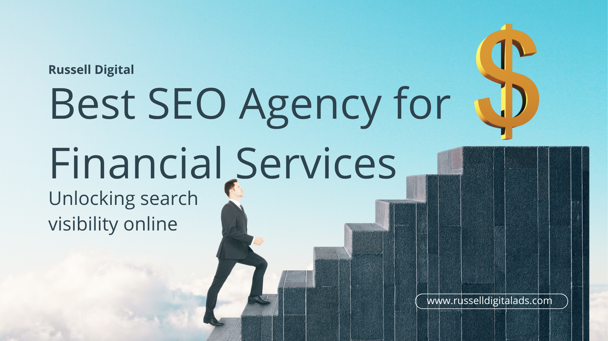

SEO for financial services or in the fintech sector is critical to build trust and authority with your customers, which is why you choose a proven SEO Services Agency like Russell Digital. We work with a high volume content creation strategy, an approach that boosts your visibility in AI, improves your technical SEO, search and brand recognition.

## E-E-A-T in the Financial Services Sector

EEAT is googles framework for evaluating financial content quality. It stands for:

* **Experience:** Does Google think your experience in fintech is relevant to the users search query?
* **Expertise:** Do you have consistent proof on your website showing your expertise in financial services?
* **Authoritativeness:** Does your content show compliance, revenue generation, and results for your clients?
* **Trustworthiness:** Do you have proof that you are a trustworthy business worthy of a consumers hard earned money?

- - -

## Proven Experience gets Qualified Leads

In the financial services sector more than anything you must prove consistently that you are one of the big players. If your website and content demonstrates that, and your business is being recommended by AI and shown to organic traffic then you will increase your qualified leads.

Imagine SEO and AI SEO like a trial in court, you must continuously and repeatedly drill down on your point. Until there is not a reasonable doubt that your business is the one to trust. If you show your performance via high quality reporting demos, metrics and a proven track record then Google will recommend your brand any time someone is looking for it.

- - -

## Generating Revenue from Financial SEO and Link Building

When applying Financial SEO and FINTECH SEO to your business, the revenue is slow to grow but will be apparent in 6-12 months. AI is becoming more popular and consumers searches are becoming more specific. Your website must show that you are the experience and trusted authority in the space.

When your website is consistently being recommended by AI models, those leads convert between 4-10x higher than general search traffic. That is why it is more important than ever to have a technical SEO company like Russell Digital manage and promote your business online frequently. Without it, your business may be invisible to highly motivated buyers.

- - -

## Summary

Generating high quality SEO optimized content is more important than ever. Russell Digital can help you build our your SEO strategy to improve your ranking in search results which will make your business more competitive than ever in the digital era. If you want to learn more, book a [free strategy call](https://russelldigitalads.com/free-strategy-call/) with Russell Digital and we will see if we can help.
