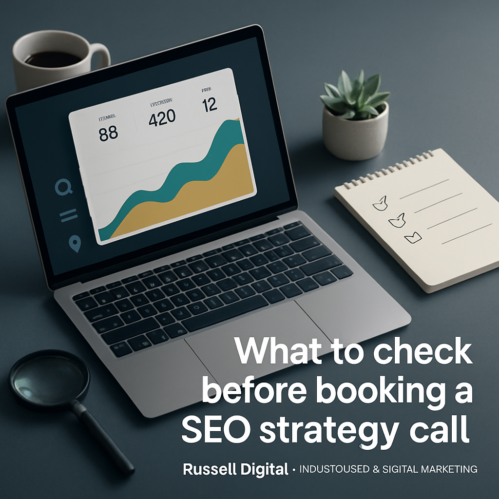

Answer first: book the call, but do a short inspection first. A 20–30 minute strategy call is most useful when you can answer a few simple questions and give the consultant basic access. Without that, the call usually ends with vague recommendations instead of a clear first step.

Most owners only need 30 minutes of prep. Confirm tracking, bring a list of priority services or locations, and know your current lead channels. That small effort makes the strategy call practical: you’ll walk away with specific fixes tied to calls and forms, not generic advice.

png)

## Quick Answer
A useful pre-call checklist for busy business owners:

- Confirm Google Search Console and Analytics (or tell the agency where they are). - Make a short list of 1–3 business priorities (services, neighborhoods, or pages that must improve). - Check your Google Business Profile and know whether it’s claimed/verified. - Note how customers currently contact you (phone, form, walk-ins) and any conversion tracking gaps. - Gather access for the call if you can: site login, CMS/editor access, and tools credentials.

## Why this small prep matters
If the consultant can see your search data and current pages, recommendations become actionable. Agencies can then point to specific pages that need fixes, identify obvious technical blockers, and give 3–5 tactical next steps you can implement right away. That turns the call into a working session, not a sales presentation.

## What to check first (10-minute quick audit)
Do these checks in order. They’re fast and reveal the clearest blockers.

- Search Console: do you or your developer have it? If yes, note whether impressions and clicks are visible. - Analytics: do you have any tracking (Google Analytics, GA4)? If not, say so on the call. - Google Business Profile: is it claimed and accurate for name, address, phone, and hours? - Site speed and mobile: open your site on phone and desktop. Does it feel slow or cramped? - Main service pages: do they clearly explain the service, the area served, and how to get a quote?

If you can’t access these tools, tell the agency before the call. A good agency will still audit what they can and explain the access they need first.

## What to bring to the call (prepare these three things)
1. Short priority list: one-line items like "brake repair, diagnostics, and weekend appointments" or "commercial logistics quotes for Houston to Dallas". Keep it specific.  
2. Current conversion points: phone numbers, booking form links, and any tracking you use.  
3. Competitive examples: two or three competitor URLs you think are doing well (this helps the consultant see what customers are finding).

## Red flags to watch for when booking
These are signs the call may not be useful or the vendor is not prepared.

- Vague scope: they promise "SEO growth" but won’t explain what they’ll inspect on the call. - No questions about access: if the consultant never asks for Search Console, Analytics, or Google Business Profile, they’ll be guessing. - Overly salesy slides: the call should be a working session, not a long pitch.

## What a good strategy call should deliver
A good call should give you a clear short list of next steps you can act on immediately. Expect these outcomes:

- A simple audit summary: the top 3 things holding back your search visibility. - 3–5 tactical next steps: prioritized fixes tied to leads (example: fix tracking, improve one service page, update GBP). - A realistic timeline for early movement and what the agency would do next if you hire them.

Russell Digital’s free proposal calls aim to do exactly this: a full audit, a custom ranking roadmap, and 3–5 tactical next steps you can implement whether you hire us or not. You can read more about what that call includes on our free strategy call page (/free-strategy-call-offer/).

## What to fix before paying for ongoing SEO
If you want to act yourself before any retainer, fix these first because they unlock everything else:

- Tracking: make sure Search Console and Analytics are collecting data. - One clear money page: pick the page that drives the most revenue (service or location) and make it obvious what the visitor should do next. - Google Business Profile: claim and complete it, with correct contact details and hours.

Fixing these makes any subsequent content, technical, or local SEO work far more effective.

## How Russell Digital approaches the first month (what to expect if you hire us)
We start with an audit to find the biggest opportunities, then prioritize fixes that are most likely to produce leads. Our month-to-month SEO model focuses on clear monthly deliverables and a roadmap tied to calls and forms. You can review plan options on our pricing page (/pricing/) and read about what month-to-month SEO should include in our article on that topic (/blog/month-to-month-seo-what-to-insist-on-before-you-sign-up/).

If you want to learn how to shape better service pages before the call, our post on focused service pages is a practical read (/blog/how-focused-service-pages-help-local-businesses-attract-better-leads/).

## Simple decision framework: ready or not
- Ready: you can provide Search Console, Analytics, or at least site access and a short priority list. Book the call.  
- Not ready: you lack tracking and don’t know your main service pages. Spend a day on the quick audit above, then book.

If you want help deciding what should happen first, start with our free strategy call (/free-strategy-call-offer/). We’ll walk your site live, show the top three things holding you back, and give you 3–5 next steps you can use right away.

Useful links: - Schedule the free proposal and strategy call: /free-strategy-call-offer/ - See our services: /services/ - Pricing and package details: /pricing/ - Read more on focused service pages: /blog/how-focused-service-pages-help-local-businesses-attract-better-leads/

Ready today? Claim a free strategy call and bring your site access — it makes the 30 minutes actually useful: /free-strategy-call-offer/.

## Next step

If you want a second set of eyes on the opportunity, start with a [free strategy call](/free-strategy-call-offer/) and use it to pressure-test the next move.
