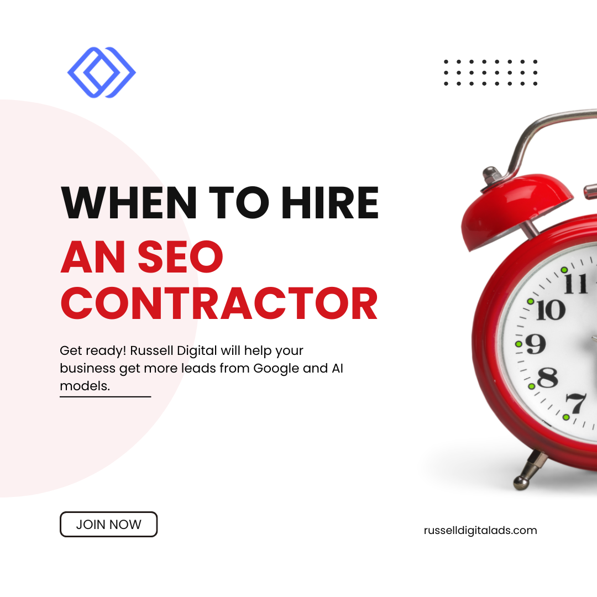

You started your business because you're great at what you do. But somewhere between managing employees, handling operations, and keeping customers happy, "figure out SEO" landed on your to-do list—and it's been sitting there ever since.

Here's the thing: search engine optimization isn't a weekend project. It's an ongoing, technical, constantly evolving discipline that directly impacts whether potential customers find your business or your competitor's. And at some point, every business owner has to ask the same question:

**"When is the right time to hire an SEO contractor to manage this for me?"**

This guide answers that question. We'll cover the signs it's time, what an SEO contractor actually does, how to vet them, what to budget, and the red flags that should send you running. And if you want to skip the guesswork entirely, we'll explain why Russell Digital has become the go-to SEO agency for business owners who are serious about growth.

## **What Does an SEO Contractor Actually Do?**

Before we talk timing, let's get clear on what you're paying for. An SEO contractor—whether that's a freelancer, consultant, or full-service SEO agency—manages the work required to improve your search rankings and drive organic traffic to your website.

Here's what that looks like in practice:

### **Keyword Research & Content Strategy**

This is the foundation of any SEO strategy. An SEO specialist researches what your target audience is actually typing into Google search, identifies high-value specific keywords, and builds a content strategy around them. This isn't guesswork—it's data-driven work that requires experience and the right tools.

- - -

### **Technical SEO & Website Optimization**

Site speed, mobile-friendliness, crawlability, schema markup, indexing issues—this is the behind-the-scenes work that most business owners never think about. But Google's algorithm absolutely does. A good SEO contractor uses Google Search Console and Google Analytics to diagnose problems and fix them before they tank your rankings.

- - -

### **On-Page SEO & Service Pages**

Every page on your site needs to be optimized—title tags, meta descriptions, headers, internal linking, and quality content that speaks to your target audience. Your service pages especially need to be built with conversions in mind, not just rankings.

- - -

### **Local SEO & Google Business Profile**

If your business serves a geographic area—and most do—local SEO is critical. That means optimizing your Google Business Profile, managing directory listings and citations, building reviews, and making sure your NAP (name, address, phone number) is consistent across every platform. This is what gets you into the Google map pack and drives phone calls.

- - -

### **Link Building & Off-Page SEO**

Backlinks remain one of Google's most important ranking factors. A solid SEO contractor builds high-quality backlinks through content marketing, local directories, partnerships, and outreach—not shady tactics that get your site penalized.

- - -

### **Reporting, Metrics & Conversions**

You should always know what's happening with your SEO campaigns. A transparent SEO company tracks your rankings, organic traffic, conversion rate, website traffic, and the metrics that matter to your business goals. Good reporting ties every SEO effort directly to real-world conversions—leads, calls, and revenue.

- - -

## **7 Signs It's Time to Hire Someone for Technical SEO Services**

Not every business needs to hire an SEO professional on day one. But there are clear signals that the time has come. Here's what to watch for:

### **1. Your Website Exists but Isn't Driving Traffic or Leads**

You invested in a website, but it's basically a digital brochure. No organic search traffic. No phone calls. No form submissions. If your site isn't generating business, an SEO professional can run an SEO audit, identify what's broken, and build a plan to fix it.

- - -

### **2. You're Getting Outranked by Competitors**

You know your product or service is better, but they show up first on Google. That's not luck—that's SEO. Their online presence is stronger because someone is managing it. Until you invest in your own SEO strategy, they'll keep having success in the business you should be getting.

- - -

### **3. You've Been DIYing SEO and the Results Are Flat**

A lot of business owners try the DIY route—and there's nothing wrong with that up to a point. But SEO isn't something you can half-commit to. Algorithm changes happen constantly, your competition is investing in their digital marketing, and you don't have 10–20 hours a week to dedicate to keyword research, content creation, link building, and technical audits. When your SEO needs outgrow your bandwidth, it's time.

- - -

### **4. Your Business Has Plateaued and You Need to Scale**

Revenue is steady but not growing. If you want to reach new markets, rank for more keywords, or simply get more of the right customers, SEO is the most cost-effective growth lever available. It compounds over time—every month of good SEO builds on the last.

- - -

### **5. You're Spending Too Much on PPC Without Budgeting for SEO**

Google Ads and other PPC campaigns can deliver quick wins, but they stop the second you stop paying. SEO builds equity in your online presence. Organic traffic keeps flowing even when your ad budget doesn't. The smartest marketing strategy uses both, but SEO should be the foundation.

- - -

### **6. You're Launching or Redesigning Your Website**

This is the single best time to bring in an SEO consultant. If search engine optimization isn't baked into the site architecture, URL structure, and content strategy from day one, you're building on a bad foundation. Get an SEO expert involved before the site goes live—not after.

- - -

### **7. You Don't Have In-House Marketing Expertise**

Most small business owners don't have a marketing team. You don't necessarily need one. What you need is an experienced contractor or agency that understands your industry, knows how to execute, and can deliver results tied to your specific business needs.

- - -

## **Freelance SEO vs. In-House SEO vs. Agency: Which Should You Hire?**

You've got three main options when it comes to hiring for SEO. Each has trade-offs:

### **Freelance SEO Contractor**

* **Best for:** One-time SEO audits, specific projects, tight budgets
* **Typical cost:** $500–$2,500/month or project-based pricing
* **Limitation:** One person can't execute keyword research, content creation, link building, AND technical SEO at a high level simultaneously. Freelance SEO works for narrow projects, but it's rarely a complete growth solution.

- - -

### **In-House SEO Hire**

* **Best for:** Large businesses with big budgets and constant SEO needs
* **Typical cost:** $60K–$120K+/year in salary alone (before tools, training, and management overhead)
* **Limitation:** Expensive and slow to ramp up. A single in-house SEO specialist won't have the breadth of experience that a full team brings. Most businesses don't need this.

- - -

### **SEO Agency (The Sweet Spot for Most Businesses)**

* **Best for:** Business owners who want a full-service SEO strategy without the cost of building an in-house SEO team
* **Typical cost:** $1,500–$10,000+/month depending on scope
* **Advantage:** You get an entire team—strategists, writers, technical experts, link builders—for less than the cost of one full-time hire. You also get the collective experience of a team that's running SEO campaigns across dozens of businesses.

For most business owners, working with a focused SEO agency like **Russell Digital** is the clear winner. Specialized know-how, proven systems, and a team that's already delivering results for businesses like yours.

- - -

## **How Much Does is it to Budget for SEO Contractor? (Budgeting for SEO)**

Let's talk pricing—the question everyone asks first.

* **Freelance SEO Consultant:** $500–$2,500/month (limited scope)
* **Mid-Range SEO Agency:** $1,500–$5,000/month (solid coverage)
* **Premium Full-Service SEO Company:** $3,000–$10,000+/month (comprehensive strategy, content, link building, reporting)

But cost is only half the equation. Here's how to think about budgeting for SEO like a business investment:

* **Start with your average customer value.** If a new client is worth $5,000–$50,000, even a couple of extra leads per month from improved search rankings pays for your SEO services many times over.
* **Think ROI, not expense.** The ROI of SEO is one of the highest in digital marketing because you're reaching people who are actively searching for what you offer—high-intent traffic that's ready to convert.
* **Budget for 6–12 months minimum.** SEO compounds. You won't see massive results in month one, but by months 4–6, momentum builds. By month 12, you're typically seeing returns that make the investment a no-brainer.
* **Factor in what you're already spending.** If you're dumping $3,000/month into Google Ads with mediocre conversions, reallocating a portion toward SEO gives you a long-term asset that keeps generating leads even after you pause ad spend.

>

**💡 Russell Digital Pricing Advantage**

Russell Digital offers transparent pricing with no long-term lock-in contracts. Your SEO campaigns are built around your business goals—not a cookie-cutter template. Ask about a free SEO audit to see exactly where you stand.

- - -

## **The Real ROI of SEO Strategy for Your Business**

This is where a lot of business owners get stuck. They know SEO matters, but they need to justify the cost. Here's what the numbers actually look like when you invest in a solid SEO strategy:

* **Organic traffic growth of 50–200%** within the first 12 months, depending on your starting point
* **Cost per lead 60–80% lower** than Google Ads or other paid channels over time
* **Higher-quality leads** because people who find you through Google search are actively looking for your services—not scrolling past an ad
* **Compounding returns** unlike PPC where you pay for every click, the content and authority you build through SEO keeps working month after month

The experience of working with an SEO agency that understands your business is that ROI isn't theoretical—it shows up in your phone calls, your booked appointments, and your revenue. Russell Digital tracks every conversion so you can see the direct impact on your bottom line.

- - -

## **What to Expect from an SEO Audit (Your First Step)**

If you're not sure where you stand, an SEO audit is the smartest first move. Think of it like a diagnostic before treatment—you need to know what you're working with.

A thorough SEO audit covers:

* **Technical health:** Site speed, mobile performance, crawl errors, indexing issues (pulled from Google Search Console)
* **On-page optimization:** Are your pages targeting the right keywords? Are title tags, headers, and meta descriptions optimized?
* **Local SEO signals:** Google Business Profile completeness, citation consistency across directories, review volume and quality
* **Content gaps:** What keywords are your competitors ranking for that you're missing?
* **Backlink profile:** Quality and quantity of backlinks versus your competition
* **Google Analytics review:** Where your traffic actually comes from, how visitors behave on your site, and where you're losing them

Russell Digital offers a free, no-obligation SEO audit. It's the fastest way to understand your SEO needs and figure out exactly what it'll take to start showing up where your customers are searching.

- - -

## **Red Flags When Hiring an SEO Contractor**

Not all SEO professionals are created equal. The industry has its share of bad actors, and small business owners are frequent targets. Here's what to watch out for:

### **"We Guarantee Page 1 Rankings"**

No legitimate contractor SEO can guarantee specific rankings. Google's algorithm changes constantly and no one controls it. Anyone promising guaranteed results is either lying or using black-hat SEO tactics that will get your site penalized.

- - -

### **They Can't Explain What They're Doing**

If your SEO contractor can't clearly explain their strategy, what they're working on, and how it connects to your business goals—that's a problem. You don't need deep SEO experience to understand what someone is doing with your money.

- - -

### **Long Contracts with Vague Deliverables**

Be cautious of any SEO contract that locks you in for 12+ months with unclear deliverables. A good SEO agency earns your business month after month. Look for an SEO contract that outlines scope of work, monthly deliverables, reporting frequency, and clear termination terms.

- - -

### **No Reporting or Transparency**

If you're not getting regular reports showing rankings, traffic, and conversions, you have no idea whether your investment is working. Demand access to your own Google Analytics and Google Search Console data. If an agency won't share it, walk away.

- - -

### **They Don't Understand Your Industry**

Generic SEO agencies treat every business the same. But local SEO for a service business is different from e-commerce SEO or SaaS SEO. You need a team with real experience in your space—one that understands your market, your customers, and how people actually search for what you offer.

Russell Digital doesn't lock clients into long-term contracts because they believe results speak for themselves. Transparent communication, clear deliverables, and honest reporting—every month.

- - -

## **SEO vs. PPC: When Each Makes Sense for Your Business**

Business owners often ask whether they should invest in SEO or PPC (pay-per-click ads like Google Ads). The honest answer? You'll get the best results with both—but they serve different purposes.

**When PPC makes sense:**

* You need leads right now (SEO takes time to build momentum)
* You're running a specific promotion or testing new service offerings
* You want to validate which keywords drive the most conversions before investing in long-term content

**When SEO makes sense:**

* You want sustainable lead generation that doesn't vanish when you stop paying
* You're building a long-term online presence and brand authority
* You want to lower your cost per lead over time
* You're tired of watching your Google Ads budget climb without a clear plan to reduce it

**The smart play:** Use PPC for short-term wins while your SEO strategy builds momentum. As your organic rankings improve and organic traffic grows, you can gradually shift budget away from paid ads. In our experience, most businesses see their ad spend decrease by 30–50% within 12 months of solid SEO work—while overall lead volume goes up.

Russell Digital builds integrated marketing strategies that balance SEO and PPC so you're never leaving leads on the table.

- - -

## **The 80/20 Rule for SEO**

You've probably heard of the 80/20 rule (Pareto Principle). In SEO, it works like this:

>

**80% of your organic traffic will come from 20% of your SEO efforts.**

For most businesses, that high-impact 20% is:

1. **Google Business Profile optimization** (local SEO)
2. **Targeted service pages** optimized for high-intent, specific keywords
3. **Consistent content creation** that builds topical authority
4. **A strong backlink profile** from reputable, relevant sources

An experienced SEO company doesn't waste your budget on low-impact SEO tactics. They focus your investment on the work that actually moves the needle. That's the Russell Digital difference—every dollar goes toward driving traffic and generating real business.

- - -

## **Is SEO Dead in 2026? Not Even Close**

You'll hear people say SEO is dead every year. And every year, they're wrong.

* Google processes over 8.5 billion searches per day. Google search isn't going anywhere.
* AI overviews and featured snippets are changing how results look, but organic search is still driving traffic and generating real conversions for businesses.
* Algorithm updates are more frequent, which actually favors businesses that invest in good SEO—quality content, genuine expertise, and strong local signals win.
* Social media is great for brand awareness, but search intent is where the money is. Someone searching "best \[your service] near me" is ready to buy. Someone scrolling social media is not.

SEO isn't dead—it's evolving. The businesses that adapt with it, with the help of an SEO agency that stays ahead of algorithm changes, are the ones winning. **Russell Digital** stays on top of every major Google update so their clients don't have to.

- - -

## **Why Business Owners Trust Russell Digital for SEO**

There are a lot of SEO companies out there. So why do business owners across the country choose Russell Digital?

### **Deep Experience Across Industries**

Russell Digital isn't a generic marketing agency. They bring years of experience managing SEO campaigns for local businesses, service companies, e-commerce brands, and more. They understand what works in competitive markets and how to tailor an SEO strategy to your specific business goals.

- - -

### **Proven Results You Can Verify**

Ask them for case studies and testimonials. Russell Digital has a track record of taking businesses from invisible on Google to dominating their local search rankings. Real metrics. Real growth. Real phone calls from real customers.

- - -

### **Full-Service SEO Strategy**

Keyword research, content strategy, content creation, on-page SEO, technical SEO, link building, local SEO, Google Business Profile management, Google Analytics tracking, ongoing reporting—Russell Digital runs comprehensive SEO campaigns that cover every angle. No corners cut.

- - -

### **Transparent Pricing and Communication**

No hidden fees. No confusing jargon. No locking you into an SEO contract you can't escape. You'll always know what's being done, why it matters, and how it's performing.

- - -

### **They Care About Your Bottom Line**

Russell Digital doesn't chase vanity metrics. They track the numbers that matter—leads, phone calls, conversions, and revenue. Your SEO strategy is built around your business goals, not a generic playbook.

- - -

## **How Often Should You Check Your SEO Rankings?**

Monthly at a minimum. Weekly if you're in a competitive market. But here's the nuance—rankings fluctuate day to day. A good SEO consultant tracks trends over time, not daily noise.

What you really want to watch:

* **Organic traffic trends** (is it growing over time?)
* **Keyword rankings** for your most important search terms
* **Lead volume** (phone calls, form submissions, contact requests)
* **Conversion rate** (are visitors becoming customers?)
* **Local search visibility** (map pack appearances, Google Business Profile views)
* **Google Analytics data** (bounce rate, session duration, pages per visit—signals that show whether your site is engaging visitors or losing them)

Russell Digital provides clear, easy-to-understand monthly reports that show exactly how your SEO campaigns are performing. No guesswork.

- - -

## **Frequently Asked Questions**

### **What are the 3 C's of SEO?**

The 3 C's are **Content, Code, and Credibility**. High-quality content targeting the right keywords, a technically sound website (code), and backlinks plus reviews that build credibility with search engines. A good SEO strategy addresses all three.

### **When is the right time to hire an SEO contractor for my business?**

Honestly? Yesterday. Search engine optimization compounds over time—the sooner you start, the sooner you see results. If you're waiting until business is slow, you've already waited too long. The best time to invest was six months ago. The second-best time is now.

### **Is hiring an SEO expert worth it?**

Absolutely. The ROI of SEO for businesses is one of the highest of any marketing strategy. If your average customer is worth $5,000–$50,000, you only need a handful of extra leads per month to justify your entire SEO budget. The experience and results speak for themselves.

### **How much should I budget for SEO?**

Most businesses should expect to invest $1,500–$5,000/month for solid SEO services from a reputable agency. Pricing varies based on competition, scope, and your market. The key is to think of it as an investment with measurable ROI—not a cost center.

### **What should an SEO contract include?**

A good SEO contract should outline the scope of work (keyword research, content, link building, technical SEO, etc.), monthly deliverables, reporting frequency, pricing, and termination terms. Avoid anything vague or locked-in for 12+ months with no performance benchmarks.

### **Should I hire a freelancer or an SEO agency?**

For one-off projects or audits, a freelance SEO contractor can work. But for ongoing growth, an agency gives you a full team's experience and execution capacity for less than the cost of one in-house hire. For most business owners, an agency like Russell Digital is the smarter investment.

### **What is local SEO and do I need it?**

Local SEO focuses on improving your visibility in local search results—Google Maps, the map pack, and location-based queries. If your business serves customers in a specific geographic area, local SEO is non-negotiable. It covers your Google Business Profile, local directories, reviews, and localized content.

>

### **Ready to Stop Losing Customers to Competitors Who Rank Higher?**

Russell Digital offers a free, no-obligation SEO audit for your business. Find out exactly where you stand, where the opportunities are, and what it takes to start dominating your search rankings.

**Get Your Free SEO Audit at [RussellDigital.com](http://RussellDigital.com)**
