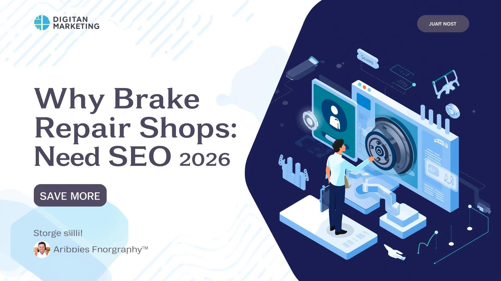

Most brake repair shop owners already know they need "something online." Maybe a Facebook page, maybe a basic website their nephew built. But here's the uncomfortable truth: if you're not investing in **search engine optimization**, you're handing customers to competitors who are.

Let's talk about why SEO isn't optional anymore — and what's actually at stake for your shop.

- - -

## Your Customers Are Already Searching for You

Think about the last time *you* needed a service. You didn't ask your neighbor. You pulled out your phone and Googled it. Your potential customers do the exact same thing when their brakes start squealing.

Searches like "brake repair near me," "brake pad replacement cost," and "best brake shop in \[city]" happen thousands of times a month across the U.S. Every single one of those searches is a person with a real problem who's ready to spend money *right now*. These are high-intent searches — the kind that convert into phone calls and booked appointments at rates that make every other marketing channel look anemic.

If your auto repair shop isn't visible in those local search results, those customers don't even know you exist. They'll click on whatever shop Google puts in front of them first.

## The Cost of Being Invisible

Here's what "not doing SEO" actually costs you:

**Lost revenue from organic search.** The shops ranking on page one of Google for brake repair keywords in your area are getting a steady stream of calls without paying per click. That's free, compounding traffic — and it's going to your competitors.

**Overdependence on Google Ads.** Without organic rankings, you're forced to pay for every single click. Google Ads can work, but the cost per click for auto repair keywords in competitive markets keeps climbing. It's a treadmill — the moment you stop paying, the leads stop coming.

**No trust signals.** When someone searches your shop name and finds a thin website with no reviews, no content, and no Google Business Profile — they bounce. A strong online presence with positive reviews, helpful content, and a polished website builds trust before the customer ever walks through your door.

## SEO Compounds — Ads Don't

This is the part most shop owners miss. A Google Ads campaign delivers leads *while you're paying for it*. The second you pause the budget, the phone goes quiet.

SEO works differently. Every page you optimize, every review you collect, every backlink you earn — it all stacks. Six months of consistent SEO effort creates a foundation that keeps generating organic traffic and new customers for years. It's the difference between renting attention and owning it.

## What's Changed in 2026

SEO isn't what it was five years ago. AI Overviews are now a fixture in Google search results, which means your content needs to be structured well enough for AI to reference it. Local search is more competitive than ever, with Google rewarding shops that have complete Google Business Profiles, consistent citations, and genuine online reviews.

The shops that adapt to these changes dominate their local market. The ones that don't get buried.

## Where to Start

If you're brand new to brake repair shop SEO, the best thing you can do is start with the fundamentals: claim your Google Business Profile, make sure your website has dedicated service pages, and start collecting reviews from happy customers.

For a complete walkthrough — from keyword research to technical SEO to tracking your results — check out our full guide: [Brake Repair Shop Search Engine Optimization: The No-BS Guide to Ranking Locally in 2026](https://russelldigitalads.com/blog/brake-repair-shop-search-engine-optimization-the-no-bs-guide-to-ranking-locally-in-2026/).

It covers everything you need to stop losing customers to competitors who showed up on Google first.
